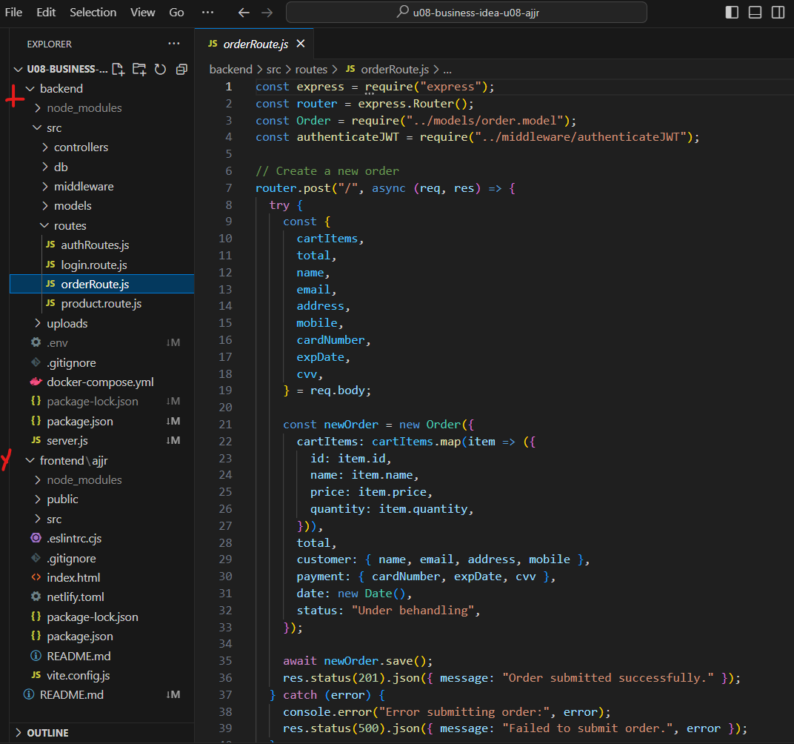

# Teorihandboken - Avancerad JavaScript (AJ)
Studerande: Shaker Nasser

## AJ 1.1 Node.js

Node.js är en välkänd och kraftfull plattform som används för att utveckla serverbaserade applikationer. Det är en öppen källkodsmiljö som kan köras på flera plattformar och gör det möjligt att använda JavaScript på serversidan. Node.js bygger på Googles V8-motor, samma motor som driver webbläsaren Google Chrome, vilket gör det möjligt att använda JavaScript utanför klientens webbläsare. Detta är en stor fördel för utvecklare då de kan använda samma programmeringsspråk både på servern och i webbläsaren, vilket skapar en mer enhetlig kodbas och en smidigare utvecklingsprocess.

En av de mest framstående funktionerna i Node.js är dess händelsedrivna och asynkrona arkitektur. Till skillnad från traditionella serverplattformar där operationer vanligtvis blockeras tills de är färdiga, är Node.js utformat för att utföra alla operationer asynkront. Detta innebär att servern inte behöver vänta på att ett anrop ska slutföras innan nästa uppgift hanteras, vilket leder till snabbare och mer responsiva applikationer. Detta är särskilt användbart när man arbetar med stora mängder samtidiga användare eller vid hantering av realtidsdata.

Node.js är även mycket populärt för att utveckla Single Page Applications (SPA). SPA är webbapplikationer där allt innehåll laddas på en enda sida och interaktionen med sidan hanteras genom JavaScript utan att hela sidan behöver laddas om. Genom att använda Node.js som backend tillsammans med front-end-ramverk som React eller Angular kan utvecklare skapa moderna, responsiva applikationer som ger användaren en snabb och smidig upplevelse.



Den kraftfulla verktygen tillåter utvecklare att använda JavaScrit till för att skapa en backend-applikation som hanterar serverlogik, filsystem och nätverksoperatoner samt mtcket mer. Innan Node.js så användes javascript endast till fron-end applikationer. 

Node.js erbjuder en mängd funktioner för webbutveckling. Det använder en asynkron och icke-blockerande I/O-modell, vilket innebär att det kan hantera flera uppgifter samtidigt utan att behöva vänta på att en uppgift ska slutföras innan nästa påbörjas. Node.js körs på en enda tråd men använder en händelsedriven arkitektur, vilket möjliggör effektiv hantering av tusentals samtidiga anslutningar. Eftersom Node.js är byggt på Google V8-motorn, kan det exekvera JavaScript-kod snabbt och effektivt. Dessutom har Node.js ett omfattande ekosystem av paket genom Node Package Manager (NPM), vilket gör det enkelt att återanvända kod och installera externa moduler för att underlätta utvecklingsprocessen.

1. https://dev.to/mehedihasan2810/nodejs-best-practices-a-guide-for-developers-4d65
2. https://medium.com/@asiandigitalhub/what-is-node-js-and-how-it-work-490f5ecba665
3. https://www.simplilearn.com/tutorials/nodejs-tutorial/nodejs-backend
4. https://javascript.plainenglish.io/what-is-node-js-5fe50e4332c8
5. https://dev.to/vyan/how-to-structure-your-backend-code-in-nodejs-expressjs-2bdd
6. https://www.simplilearn.com/tutorials/nodejs-tutorial/what-is-nodejs

## AJ 1.2 Express

Express är ett välkänt och kraftfull ramverk för webbapplikationer för Node.js som gör webbapplikations- och API-utveckling enklare och effektivare. Express är snabbt, anpassningsbart och "ointressant", vilket innebär att det inte kräver att utvecklare håller sig till en specifik struktur eller designfilosofi. Istället ger det ett enkelt sätt att bygga skalbara och lätta att underhålla applikationer. Express stöder också arkitekturen Model-View-Controller (MVC), som är ett vanligt mönster för att strukturera webbapplikationer.
Utvecklare kan ställa in och använda Express i sitt arbete med Node.js och npm (Node Package Manager). Det är ett toppval för att bygga enkla webbplatser pcj knepiga appar och API:er.

Routing spelar en nyckelroll i Express och syftar till att hantera hur en webbapp svarar på olika klientförfrågningar till specifika slutpunkter. Dessa slutpunkter består ofta av en URI (som /home eller /about) och en HTTP-metod (GET, POST, PUT DELETE). Genom att använda routing kan utvecklare bygga responsiva och interaktiva webbappar som hanterar olika typer av förfrågningar baserat på vad användaren behöver.
En enkel routermetod i Express:

```js
app.get('/books', (req, res) => {
  res.send('books page');
});
app.get('/about', (req, res) => {
  res.send('about');
});
```

Express har en annan nyckelfunktion: middleware. Det här är funktioner som har tillgång till begäran (req), svaret (res) och nästa funktion i appens begäran-svar-cykel. De behandlar förfrågningar innan de når sina slutdestinationer eller ändrar svar innan appen skickar dem till kunden. Du kan använda mellanprogram för att hantera uppgifter som att kontrollera om en användare är inloggad för att hålla loggar eller lägga till specifika rubriker till svar.
Express har ett grundläggande sätt att ställa in en routermetod. Det ser ut så här:

```js
app.use((req, res, next) => {
  console.log('En ny begäran mottogs vid ' + Date.now());
  next();  // Går vidare till nästa middleware eller rutt
});
```

1. https://www.codecademy.com/article/what-is-express-js
2. https://medium.com/@Brilworks/what-is-express-js-a-comprehensive-guide-to-beginners-b289a25bd414
3. https://dev.to/bilal1718/how-to-create-a-backend-api-in-express-js-e0k
4. https://dev.to/dipakahirav/modern-api-development-with-nodejs-express-and-typescript-using-clean-architecture-1m77
5. https://www.freecodecamp.org/news/the-express-handbook/
6. https://www.freecodecamp.org/news/express-explained-with-examples-installation-routing-middleware-and-more/

## AJ 1.3 Progressive Web Apps

En Progressiv Webbapp (PWA) kombinerar de bästa delarna av webbplatser och mobilappar. Den utnyttjar den senaste webbläsartekniken för att ge användarna en upplevelse som känns mer som en vanlig app. Detta inkluderar att kunna fungera offline, skicka notiser och ladda snabbare än vanliga webbsidor.

Problem som PWAs försöker lösa:

Internetberoende: Vanliga webbappar kräver en bra internetanslutning för att fungera. PWAs kan fungera offline eller när internetanslutningen är långsam.

Hastighet: Webbappar kan vara långsammare än appar du laddar ner. PWAs är byggda för att starta snabbt och fungera smidigt.

Svårt att lägga till på hemskärmen: Du kan inte lägga till vanliga webbappar på din hemskärm som vanliga appar. Men du kan lägga till PWAs direkt från din webbläsare utan att behöva gå till en appbutik.

Hur PWAs hjälper:

Fungerar offline: PWAs använder särskilda verktyg för att spara vad de behöver. Detta gör att de kan fortsätta fungera även när du inte är online.

Snabbare prestanda: PWAs hämtar det de behöver från sparad data. Detta ger användarna en smidig och snabb upplevelse.

### Dessa kritier måste uppfyllas för att få en fungerande PWA applikation:

HTTPS: Din webbapp måste köras på en säker anslutning. Detta håller den säker och gör att servicearbetare kan utföra sitt jobb.

Web App Manifest: Denna JSON-fil talar om för PWA:n hur den ska bete sig. Den inkluderar saker som appikoner, namn, startpunkt och hur den ska visas.

Service Worker: Detta är ett skript som körs i bakgrunden. Det möjliggör caching, push-meddelanden och offlineanvändning.

### Fördelar och nackdelar med att göra en app till en PWA

Fördelar:
Fungerar på alla plattformar och enheter.
Kostar mindre än att skapa separata appar för iOS och Android.
Laddar snabbare och fungerar offline, vilket gör användarna nöjda.

Nackdelar:
Kan inte använda vissa enhetsfunktioner, som Bluetooth eller avancerade kamerakontroller.
Vissa funktioner kanske inte fungerar lika bra på vissa plattformar, särskilt på iOS där PWAs inte har lika stort stöd.

Vad kan en serviceworker göra?

En service worker är ett skript som körs i bakgrunden och hanterar olika uppgifter som:

Lagra resurser: Detta gör att PWAs kan fungera utan internetanslutning eller snabba upp laddningen genom att hämta resurser från lagring.

Hantera nätverksförfrågningar: Den kan styra hur appen hanterar nätverksförfrågningar, vilket hjälper till att optimera resurser och förbättra prestandan.

1. https://medium.com/@blockchain_simplified/what-is-a-pwa-an-intro-to-progressive-web-apps-3f280071f909
2. https://dev.to/udoka033/progressive-web-apps-pwa-a-comprehensive-guide-57ii
3. https://www.rabitsolutions.com/blog/examples-of-pwa-development/
4. https://www.freecodecamp.org/news/what-are-progressive-web-apps/

## AJ 1.4 Typningssystem för Javascript (ex TypeScript, Flow)

TypeScript är ett kodningsspråk som utökar JavaScript och lägger till statisk typkontroll. Microsoft skapade det och folk använder det ofta för att bygga stora skalbara appar. En av de viktigaste fördelarna med TypeScript är att det hjälper kodare att skriva starkare kod som är lättare att underhålla genom att föra in typer i JavaScript som är ett dynamiskt språk. JavaScript är ett tolkat språk som räknar ut typer när det körs men TypeScript introducerar typer innan programet körs.

TypeScript fungerar genom att utvecklare skriver kod i TypeScript, som sedan konverteras till JavaScript. Denna konvertering upptäcker potentiella fel och andra problem innan koden körs, vilket leder till färre fel och problem när programvaran är aktiv. TypeScript använder också "duck typing", vilket innebär att det kan gissa en variabels typ baserat på dess användning, utan att utvecklaren behöver stava det.
Konverteringen sker genom kommandot tsc (TypeScript Compiler). Detta kommando ändrar TypeScript-filer (som slutar med .ts) till standard JavaScript-filer som kan köras i alla inställningar som stöder JavaScript.
Anteckningar i TypeScript

TypeScript ger dig massor av alternativ för att lägga till typinformation till din kod. Här är några vanliga sätt att göra det:

nummer: värden som är siffror.
sträng: bitar av text.
boolean: sanna eller falska värden.
any: När du inte vill fästa en specifik typ. Detta kan vara praktiskt men också riskabelt eftersom det stänger av typkontroll.
void: Visar att en funktion inte ger tillbaka något värde.
array: Typen för en lista med saker, som nummer[] för en lista med nummer.

TypeScriptkod har vissa fördelar jämfört med vanlig JavaScript. Den stora är statisk typkontroll, som upptäcker fel när du kompilerar istället för när du kör koden. Det betyder att din kod är starkare och lättare att hålla koll på. Så här skiljer sig JavaScript och TypeScript.

TypeScript har några starka skrividéer som gör koden mer anpassningsbar och återanvändbar. Här är några:
Generika: 
Med generika kan du bygga återanvändbara delar som fungerar med många typer utan att förlora typkontrollen. Här är ett exempel på en generisk funktion:
```js
function identity<T>(arg: T): T {
  return arg;
}
let result = identity<number>(42); 
```

Tuples: 
En tuple är en maskinskriven lista där varje objekt kan ha en annan typ. Detta hjälper till att representera ett snabbt element med specifika typer.

```js
let tuple: [string, number];
tuple = ['hello', 10]; 
```

Unions: Unions låter en variabel ha flera möjliga typer. Till exempel kan en variabel vara antingen ett tal eller en sträng:,

```js
function printId(id: number | string) {
  console.log(id);
}
```


1. https://dev.to/janvierjr/intro-to-typescript-5dhi 
2. https://medium.com/@krishsurya1249/typescript-tutorial-f8d45ce5766b
3. https://www.freecodecamp.org/news/learn-typescript-beginners-guide/


## AJ 1.5 Funktionell programmering i JavaScript

Funktionell programmering är ett tillvägagångssätt som ser beräkningar som ett sätt att utvärdera matematiska funktioner. Det har sitt ursprung i lambda-kalkyl, ett formellt system som Alonzo Church utvecklade på 1930-talet. Detta system skapade en grund för att förklara beräkningar som bygger på funktioner. Språk som Lisp (1958) och ML (1973) banade vägen för funktionell programmering. De påverkade nyare språk som Haskell och Scala.
Funktionell programmering betonar att skriva rena funktioner. Dessa funktioner är förutsägbara och har inga bieffekter. Detta innebär att de alltid ger samma output för ett givet input utan att ändra något utanför deras omfattning. Denna fokus på oföränderliga data gör programmen mer pålitliga. Det gör dem också lättare att förstå och säkrare att köra samtidigt på olika processorer.

1. https://thecodest.co/sv/blog/kraften-i-funktionell-programmering-i-javascript-del-1-introduktion/
2. https://dev.to/alexmercedcoder/deep-dive-into-functional-programming-in-javascript-851
3. https://www.freecodecamp.org/news/functional-programming-in-javascript/

## AJ 1.6 Avancerad funktionalitet i ES.next

ECMASprict är en standard för JavaScript som gör att det fungerar likadant i olika webbläsare och miljöer. Den bestämmer regler, funktioner och hur språket ska se ut. Standard uppdateras ofta för att lägga till nya funktioner och förbättringar.

ES.next är ett samlingsnamn för framtida versioner av ECMAScript, standarden för programmeringsspråket JavaScript. ES.next syftar specifikt på den version av ECMAScript som är i utveckling och som följer efter den nuvarande standarden.

Man kan bidra med nya feature i form av ider men dessa måste skickas in till TC-39 kommiten. Nya funktioner och förslag granskas och godkänns av TC39-kommittén som ansvarar för att utveckla och underhålla ECMAScript-standarden. Deras uppgift är att säkerställa att bidragsgivare följer standarden och att JavaScript fortsätter att utvecklas och förbättras.
Varje feature behöver gå genom dem fyra olika stegen i procecessn för att inkuderas i standarden.

De fyra stegen är:
0: Idéstadium (Strawman) - Förslag lämnas in till specifikationen.
1: Förslag (Proposal) - Förklara varför förslaget behövs, beskriv en möjlig lösning och identifiera eventuella problem.
2: Utkast (Draft) - Beskriv hur det ska fungera med korrekt syntax och tekniskt språk.
3: Kandidat (Candidate) - Det behövs mer feedback från utvecklare och användare för att förbättra förslaget.
4: Färdig (Finished) - Förslaget är redo att läggas till i den officiella ECMAScript-standarden.

ECMAscirpt är ständigt inom förändring vilket innebär att som utvecklare så ska man vara förberdd på att läsa sig in i nya förändringar. Några av dessa features som har kommit in den seanste året:

`replaceAll()` - En metod som låter dig byta ut alla förekomster av en sträng mot en annan i ett textstycke. Tidigare kunde `replace()` endast byta ut den första matchningen, men med `replaceAll()` byts alla förekomster ut på en gång.

`Promise.any()` - Denna metod tar en lista av löften (Promises) och returnerar det första löftet som uppfylls (resolves). Om inget löfte uppfylls, och alla misslyckas, returnerar det ett fel. Detta skiljer sig från `Promise.all()`, som väntar på att alla löften ska uppfyllas eller misslyckas.

Kodexempel:

```js
const paragraph = "I think Ruth's dog is cuter than your dog!";

console.log(paragraph.replaceAll('dog', 'monkey'));
// Expected output: "I think Ruth's monkey is cuter than your monkey!"

// Global flag required when calling replaceAll with regex
const regex = /Dog/gi;
console.log(paragraph.replaceAll(regex, 'ferret'));
// Expected output: "I think Ruth's ferret is cuter than your ferret!"
```

1. https://github.com/tc39/proposals
2. https://tc39.es/process-document/
3. https://developer.mozilla.org/en-US/docs/Web/JavaScript/Reference/Global_Objects/String/replaceAll


## AJ 1.7 JavaScript i integrerade system
Beskriv rubriken här

## AJ 1.8 Native bundeling av JavaScript för olika operativsystem och enheter

Native bundling packar en app och dess nödvändiga beroenden i ett format som kan köras direkt på en specifik plattform eller ett operativsystem. Detta gör att appen beter sig som om den var byggd med plattformens egna språk och verktyg. Syftet är att ge användarna en upplevelse som känns mer "native" och låta appen använda plattformens resurser för att prestera optimalt.

Ett kraftfullt verktyg för native bundling i JavaScript-ekosystemet är React Native, som utvecklades av Facebook. Till skillnad från traditionella web-to-desktop-ramverk, tillåter React Native utvecklare att bygga mobila applikationer för både Android och iOS med hjälp av JavaScript, samtidigt som koden kompileras till faktiskt native kod. Världskända företag som Instagram, Airbnb och Tesla använder React Native, vilket visar på dess styrka och mångsidighet. Plattformen har en stor och aktiv community som erbjuder ett brett utbud av moduler och bibliotek, vilket underlättar för utvecklare att snabbt implementera komplexa funktioner.

Fördelar med native bundling:

Korsplattformskod: Utvecklare kan skriva koden en gång och sedan distribuera den på flera operativsystem. Detta sparar tid och minskar behovet av att underhålla separata kodbaser för varje plattform.

Enklare distribution: Genom att paketera alla beroenden tillsammans säkerställer native bundling att applikationen kan köras på olika system. Detta eliminerar behovet av komplexa installationsprocesser eller versioneringsproblem.

Tillgång till native API:
Applikationen kan använda systemfunktioner som filhantering, notifikationer och systemintegration utan behov av en webbläsare, vilket ger en smidig användarupplevelse.

Nackdelar med native bundling:

Stora filstorlekar: Bundlade appar kan bli ganska stora eftersom hela runtime-miljön ofta inkluderas, vilket kräver mycket lagringsutrymme.

Prestandaproblem: Native bundlade appar, såsom de som byggts med Electron, använder mer minne och CPU-resurser än appar som utvecklats med språk som Swift eller C++.

Avsaknad av plattformspecifika förbättringar: Även om appen fungerar på flera plattformar kanske den inte utnyttjar plattformspecifika optimeringar eller designelement, vilket kan leda till en mindre polerad användarupplevelse.

Native bundling är utmärkt när man behöver lansera en app snabbt på flera plattformar utan att skriva om koden för varje plattform. Det är också idealiskt för prototyper intern verktyg eller appar där snabb leverans är viktigare än maximal prestanda. Däremot är det kanske inte det bästa valet för appar som kräver hög prestanda som spel eller resurskrävande applikationer/program.

1. https://www.freecodecamp.org/news/react-js-vs-react-native-whats-the-difference/
2. https://www.computer.org/publications/tech-news/trends/benefits-of-react-native
3. https://www.netguru.com/glossary/react-native