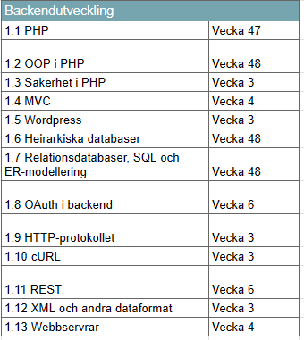
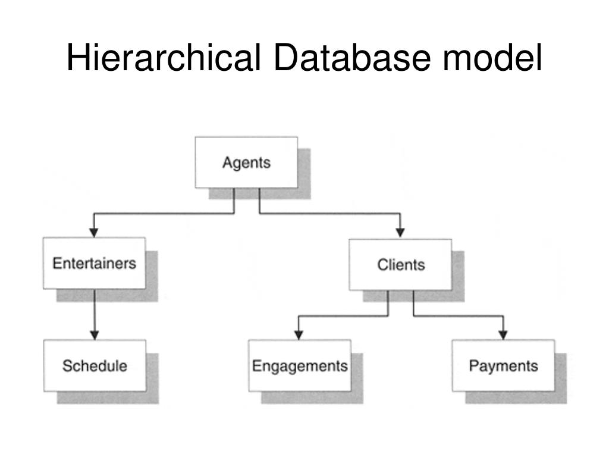
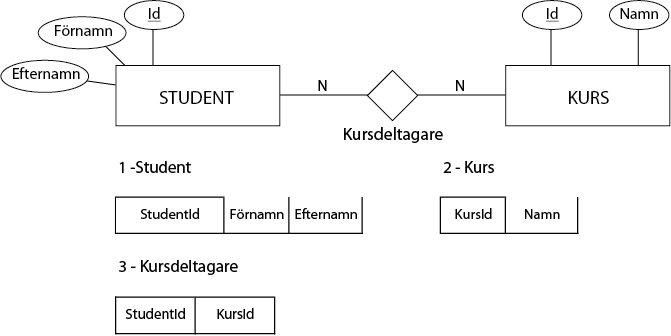
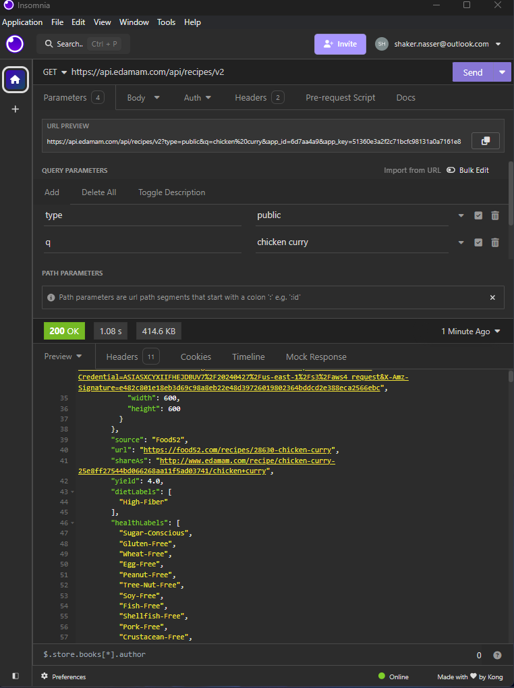

# Teorihandboken - Backendutveckling (BE)
Studerande: Shaker Nasser

## BE 1.1 PHP

PHP (Hypertext Preprocessor) är ett serversidigt skriptspråk. Det är ett skriptspråk som kan exekveras (köras) utan ett kompileringssteg. Detta innebär att PHP hjälper märkspråk som HTML att generera sidor. Detta sker genom att man kan ansluta till en databas. PHP är ett mycket användbart skriptspråk.

PHP kan användas för att skapa konsolapplikationer och grafiska användargränssnitt, men det används främst för att programmera dynamiska webbsidor på internet. Genom PHP-programmering kan man skapa en dynamisk webbplats. En dynamisk webbplats gör att en besökare kan interagera med innehållet på ett helt annat sätt än om webbplatsen enbart använde HTML. Det går till exempel att köpa en produkt eller skriva ett meddelande på en dynamisk webbplats. Det är också värt att notera att alla webbsidor innehåller en del ren HTML-kodning. Detta behövs för att besökarnas webbläsare ska få relevant information om hur koden ska tolkas.

När en internetanvändare använder en webbläsare och begär en PHP-sida från servern, dirigerar servern förfrågan till en webbtjänst på servern. Webbservern känner av behovet av PHP-databasen och bearbetar den som ett program med hjälp av en PHP-modul, istället för att skicka dess innehåll direkt till klienten. Programmets utdata, vanligtvis i form av standardutdata, skickas sedan till klienten som svar på förfrågan. Klienten identifierar typen av resultat (HTML-kod, bild, PDF-innehåll, arkiv osv.), och resultaten visas sedan för klienten på motsvarande sätt.

Nyligen har PHP nått en högre nivå med hjälp av paket (PHP-ramverk) som används som verktyg för att snabbare och säkrare utveckla webbapplikationer. Dessa paket syftar till att sätta samman färdiga verktyg från olika teknologier inom ett praktiskt ramverk, så att skapade paket kan användas som verktyg. Detta gör att utvecklare kan ha tillgång till grundläggande teknologiska funktioner som de använder, och fokusera enbart på logiken i den applikation de bygger, istället för att oroa sig för filorganisation, objektklassificering och säkerhetsproblem.

PHP ramverken följer vanligtvis MVC strukturen. En av dem mest använda ramverken inom PHP är laravel. Laravel följer en väldigt tydlig sturkur mapp och det gör den till den optimala ramverk att börja med när man jobbar inom fullstack. Detta hjälper även till när man går vidare till att jobba med andra ramverk inom webbuteckling, tex Angular. 

MVC strukturen i Laravel går enligt följande:

Modellen lagrar affärslogiken och applikationsdata. Den skickar data till Vyn, presentationslagret. Användaren interagerar med Vyn och kan mata in instruktioner via Kontrollern. Kontrollern skickar dessa kommandon till Modellen, och cykeln fortsätter.

1. https://www.oxfordwebstudio.com/sv/vet-du/vad-ar-php 
2. https://dbwebb.se/kunskap/kom-i-gang-med-php-pa-20-steg
3. https://kinsta.com/blog/php-frameworks/
4. https://dev.to/kinsta/master-laravel-with-these-free-tutorials-5gco

## BE 1.2 OOP i PHP

Objektorienterad programmering (OOP) är en metodik som används flitigt även inom PHP. Denna metodik möjliggör en mer strukturerad och läsbar kodbas. Genom att organisera koden med objekt, som är instanser av klasser, blir både modifiering och avläsning av koden betydligt smidigare. Klasser definierar egenskaper (variabler) och metoder (funktioner) som kan åberopas från instanser av den klassen. Koncept som inkapsling och arv är avgörande för att förstå och effektivt tillämpa objektorienterad programmering i PHP.

``` php
class Person {
    public $name;
    public $age;

    public function __construct($name, $age) {
        $this->name = $name;
        $this->age = $age;
        echo "En ny person har skapats.";
    }
}
$person1 = new Person("Shaker", 25);
```

Ett objekt är en konkret instans av en klass. När du skapar ett objekt från en klass, får objektet tillgång till de egenskaper och metoder som definierats i klassen. Objekten är de faktiska "föremålen" eller "instanserna" som skapas enligt klassens specifikationer.

```php
$minBil = new Bil();
$minBil->modell = "Volvo";
$minBil->färg = "Blå";
$minBil->köra();
```

Publika medlemmar (variabler och metoder) är de som kan nås och användas utanför klassen. De är synliga och tillgängliga för andra delar av koden, inklusive andra klasser.

```php
class Konto {
    public $saldo;

    public function sättSaldo($belopp) {
        $this->saldo = $belopp;
    }
}

```

Privata medlemmar är begränsade till att endast vara åtkomliga inom den klass där de är deklarerade. De är inte synliga eller tillgängliga utanför klassen och används för att skydda interna detaljer och säkerställa att de inte påverkas externt.

```php
class Användare {
    private $användarnamn;
    private $lösenord;

    public function sättAnvändarnamn($namn) {
        $this->användarnamn = $namn;
    }

    public function sättLösenord($lösen) {
        $this->lösenord = $lösen;
    }
}

```
En konstruktor är en särskild metod i en klass som körs automatiskt när ett objekt skapas. Dess huvudsakliga syfte är att initialisera objektets egenskaper eller utföra andra förberedande åtgärder. Konstruktorn kallas automatiskt när du skapar ett objekt och används för att ge objektet

```php
class Person {
    public $namn;


    public function __construct($startNamn) {
        $this->namn = $startNamn;
        echo "En ny person skapades med namnet $startNamn.";
    }
}
$nyPerson = new Person("Shaker");
```

1. https://www.tutorialspoint.com/php/php_object_oriented.htm
2. https://www.honeybadger.io/blog/in-depth-guide-to-object-oriented-programming-in-php/
3. https://medium.com/@imadevguyanand/php-what-is-oop-413b566f9a94

## BE 1.3 Säkerhet i PHP

Säkerhet är en viktig aspekt för att skydda information och system från obehörig åtkomst, skadlig kod och andra hot, särskilt inom IT. IT-säkerhet handlar om att skydda informationstekniksystem från obehörig åtkomst, användning, förändring eller förstörelse. Det innefattar olika åtgärder och tekniker för att säkerställa konfidentialitet, integritet och tillgänglighet av data och system.

Applikationssäkerhet:
Applikationssäkerhet fokuserar på att säkra programvaror och applikationer från olika hot och sårbarheter. Det innebär att implementera säkerhetsåtgärder i design, utveckling och drift av applikationer för att minimera riskerna för attacker och obehörig åtkomst. Säkerhet innebär att skydda program och appar från hot genom att använda säkerhetsåtgärder vid design, utveckling och drift. Det inkluderar övervakning, sårbarhetsanalys och utbildning för att förhindra attacker.

SQL-injektioner:
SQL-injektioner är en typ av säkerhetshot som riktar sig mot databasdrivna applikationer. Vid en SQL-injektion kan en angripare infoga skadlig SQL-kod i en SQL-fråga som utförs av en applikation. Om sårbarheten utnyttjas framgångsrikt kan detta leda till obehörig åtkomst, manipulation eller förstörelse av databasen. För att förhindra SQL-injektioner bör utvecklare använda parametriserade frågor och sanitisering.

PHP ramverken erbjuder kraftig säkerhet. I Laravel erbjuds ett inbyggt CSRF-skydd för att förhindra CSRF-attacker. Detta åstadkoms genom att generera och kontrollera CSRF-token för varje formulär som skickas till servern. Genom att inkludera @csrf-direktivet i formulär läggs automatiskt ett CSRF-token till varje POST-formulär. Detta använde vi tex i vår IMDB clone projekt där vi skapade flera formulär som användare integrerade med. 

Jag implementerade en åtgärd i 'Providers -> AppServiceProvider.php' för att säkerställa att CSRF-skyddet fungerar korrekt även i en distribuerad miljö. Åtgärden innebar att jag tvingade Laravel att generera HTTPS-länkar istället för HTTP-länkar.

```php
    public function boot(): void
    {
        if ($this->app->environment('production')) {
            URL::forceScheme('https');
        }
    }
```

1. https://www.cloudways.com/blog/php-security/#sql - SQL injection
2. https://www.cloudways.com/blog/php-security/#cross
3. https://laravel.com/docs/11.x/csrf - Laravel Security tokens 
4. https://www.geeksforgeeks.org/laravel-csrf-protection/

## BE 1.4 MVC

MVC (Model-View-Controller) är ett designmönster inom mjukvaruutveckling som används för att organisera och strukturera koden på ett sätt som gör den mer modulär, underhållbar och skalbar. Genom att dela upp applikationen i tre huvudkomponenter separeras logik, presentation och datahantering. Modellen representerar data och regler för att hantera den. Vyn är ansvarig för presentationen av data till användaren, medan kontrollern hanterar interaktionen mellan modellen och vyn. Användning av MVC-mönstret möjliggör skapandet av robusta applikationer med en tydlig ansvarsfördelning och enkel återanvändning av kod.

Klienten skickar en HTTP-förfrågan till servern (hårdvara): Förfrågan specificerar en IP-adress och olika HTTP-metoder som GET, POST eller andra beroende på ändamålet med förfrågan. Denna förfrågan passerar genom webbservern (mjukvara), som tar emot och hanterar HTTP-förfrågan, vidarebefordrar den till rätt del av applikationen och kommunicerar med den.

Koden kontrolleras och svar ges i form av en HTTP-respons: Här träder MVC-arkitekturen in i bilden. Kontrollern tar emot förfrågan, bearbetar den, anropar den relevanta modellen för att hämta eller manipulera data, och interagerar även med vyn för att definiera hur datan ska visas. Slutligen skickar kontrollern en HTTP-respons tillbaka till klienten.

MVC möjliggör enkel återanvändning av kod och minskar komplexiteten. Det ökar flexibiliteten vid kodskrivning och minskar upprepning av händelser.

**Modell (Model):** Bearbetar och hanterar data. Modellen hämtar och bearbetar information från externa källor som databaser enligt affärsregler och skickar den sedan vidare till andra delar av systemet, särskilt till vyn för att visas för användaren.

**Vy (View):** Hanterar visuell presentation av data. Vyn innehåller metoder för att skapa och utföra frågor för att interagera med datakällor och återspegla de önskade operationerna.

**Kontroller (Controller):** Hanterar HTTP-förfrågningar. Kontrollanten samordnar interaktionen mellan modellen och vyn, väljer lämplig modell och vy för att svara på en förfrågan, och skickar sedan en lämplig HTTP-respons till klienten.

I ett Laravelprojekt används MVC-arkitekturen så här: Modeller representerar databastabeller och hanterar datalagring. Vyer definierar användargränssnittet med Blade-mallar. Kontroller hanterar HTTP-förfrågningar och skapar svar baserat på modelldata för visning i vyerna. Detta ger en strukturerad och modulär kodbas för enklare underhåll och skalbarhet.

1. https://kinsta.com/blog/php-frameworks/ - MVC strukur 
2. https://www.geeksforgeeks.org/mvc-framework-introduction/
3. https://fkrihnif.medium.com/understanding-the-mvc-architecture-in-laravel-a-comprehensive-guide-8f620cc139b6
4. https://medium.com/@nnadichime04/laravel-mvc-architecture-explained-21e783dbbd14

## BE 1.5 Wordpress

Wordpress är en hemsideverktyg med öppen källkod. Wordpress ger möljghet till att starta en sida och hosta besökare. Starten av Wordpress var att underlätta möjligheten till bloggplattformar att utvecklas. Nu används Wordpress av flera stora miljardföretag så som Microsoft och Spotify. 

En av de mest framträdande funktionerna i WordPress är dess användning av plugins, vilka tillåter användare att utöka funktionaliteten hos sina webbsidor. Det finns tusentals plugins tillgängliga, som täcker allt från sökmotoroptimering (SEO) till säkerhet och sociala medier. På liknande sätt kontrollerar WordPress utseendet på en webbplats med hjälp av teman. Det finns ett brett utbud av gratis och premiumteman tillgängliga för att anpassa utseendet och känslan på en webbplats.

WordPress stöder en mängd olika innehållstyper, inklusive text, bilder, ljud och video, vilket gör det till ett mångsidigt verktyg för webbutveckling. Plattformen har vuxit och förfinats över tid och har blivit ett populärt val inte bara för stora företag utan även för småföretag och enskilda användare som vill skapa och underhålla sina egna webbplatser utan att behöva djupgående tekniska kunskaper. Med dess enkelhet och flexibilitet har WordPress blivit en viktig del av internets webbutvecklingslandskap.

WordPress fortsätter att utvecklas och förbättras med regelbundna uppdateringar och ett engagerat community av utvecklare och användare som bidrar till dess tillväxt och anpassningsbarhet. Det är en plattform som erbjuder möjligheter för alla, från nybörjare till erfarna webbutvecklare, att skapa professionella och unika webbplatser på en intuitiv och effektiv plattform.

WordPress fortsätter att vara av stor betydelse genom regelbundna uppdateringar och ett starkt community som stöder dess tillväxt och mångsidighet på webbutvecklingsområdet.

1. https://kinsta.com/se/kunskapsbas/vad-ar-php/
2. https://www.one.com/sv/webbhotell-hosting/vad-ar-php
3. https://kinsta.com/knowledgebase/what-is-wordpress/
4. https://www.whitepeakdigital.com/blog/what-is-wordpress/

## BE 1.6 Heirarkiska databaser

En data bas är samling av data som finns lagrad för hämtas i bitar. Förr i tiden använde man papper och penna för att spara data. Detta kallades för analog databas. Nu förtiden sköts det mesta genom elektroniskt databas. 

Hierarkiska databaser är en specifik modell inom databasvärlden som organiserar data i en trädliknande struktur. I denna struktur kallas varje datatopp för en nod och kan ha noll eller flera underordnade noder. Root-noden representerar den översta nivån av hierarkin, och därifrån grenar sig trädet ut med föräldrar, barn och segment.

Denna modell används inom olika områden, till exempel för att representera organisationsträd där avdelningar och anställda struktureras hierarkiskt. Likaså återspeglar filsystemet på datorer en hierarkisk struktur, där varje mapp representerar en nod och filer ligger som löv i trädet. Hierarkiska databaser lämpar sig också väl för att hantera produktstrukturer där varje komponent kan ha underdelar.

Fördelarna med hierarkiska databaser inkluderar deras effektivitet när det gäller att hantera naturligt hierarkisk data och möjligheten att snabbt navigera mellan närliggande noder. Genom att använda hierarkiska databaser kan man enkelt organisera och strukturera data på ett sätt som återspeglar verkliga hierarkier. Hierarkiska databaser kan dock vara mindre flexibla jämfört med relationsdatabaser, vilket kan begränsa deras användbarhet i vissa scenarier.

Strukturen i hirearkiska databaser är väldigt minneskrävande till skillnad från relationsdatabaser. Sökningen av data generaras långsamt. Dessutom erbjuder hierarkiska databaser enkelhetsfaktor vid sökning och åtkomst av data. Eftersom varje nod har tydliga föräldrar och underordnade noder, kan man snabbt hitta och manipulera specifika datapunkter utan att behöva söka igenom hela databasen.



1. https://www.heavy.ai/technical-glossary/hierarchical-database
2. https://www.redswitches.com/blog/hierarchical-databases/
3. https://www.c-sharpcorner.com/article/what-is-a-hierarchical-database/

## BE 1.7 Relationsdatabaser, SQL och ER-modellering

Relationella databaser utgör en grundläggande modell inom hanteringen av databaser och arbetar med tabeller och de relationer som finns mellan dessa tabeller. Genom att organisera data i tabellformat minskar relationella databaser onödig upprepning av information och främjar därmed en effektiv och strukturerad lagring av data.

Varje tabell i en relationsdatabas följer ett fördefinierat schema som beskriver strukturen och innehållet i tabellen. Detta schemas beskrivning fungerar som en vägledning för vilken typ av data som kan lagras i tabellen. Schemat ger en tydlig översikt över databasens struktur och underlättar både förståelsen och hanteringen av dess innehåll.

Inom relationsdatabaser används även dimensionstabeller för att organisera data. Dessa tabeller består av rader, också kallade tupler, där varje rad representerar en entitet eller objekt, och varje kolumn, eller attribut, ger en beskrivning av data som är relaterad till entiteten.

I en relationsdatabas är det viktigt att förstå skillnaden mellan en primärnyckel och en främmande nyckel för att säkerställa integriteten och relationerna inom datastrukturen.

En primärnyckel fungerar som en unik identifierare för varje post i en tabell och säkerställer att varje rad kan identifieras på ett entydigt sätt. Den måste ha unika värden och får inte vara NULL. Primärnyckeln är avgörande för att upprätthålla dataintegriteten och underlättar effektiv hämtning av data.

En främmande nyckel i ett fält i en tabell som skapar en länk till primärnyckeln i en annan tabell. Denna länk skapar en relation mellan de två tabellerna och möjliggör implementeringen av referentiell integritet. Med andra ord motsvarar en främmande nyckel i en tabell primärnyckeln i en annan tabell och främjar anslutningen mellan relaterade data över olika tabeller i databasen.



ER-diagram (Entity-Relationship) är en grafisk representation som används för att visualisera och planera strukturen av en relationsdatabas. Genom att använda symboler och linjer för att representera entiteter och deras relationer ger ER-diagrammet en visuell översikt över databasens struktur och hjälper till att förstå hur olika tabeller är kopplade till varandra.

SQL, eller Strukturerat Frågespråk, är det standardspråk som används för att interagera med relationsdatabaser. SQL har två huvudsakliga komponenter:

DDL (Data Definition Language) denna del hanterar strukturer och definitioner av databasobjekt, inklusive skapandet och ändringen av tabeller, index och andra strukturer.

DML (Data Manipulation Language) fokuserar på manipulation av data i databasen, inklusive insättning, uppdatering och borttagning av data.

Genom att använda SQL kan användare effektivt definiera och hantera både databasens struktur och dess innehåll, vilket gör det till ett kraftfullt verktyg för att interagera med relationella databaser.

Exempel på hur man kan skapa en SQL tabell med kommando (Create):

```sql
DROP TABLE IF EXISTS `tasks`;
CREATE TABLE `tasks` (
  `id` int(255) NOT NULL AUTO_INCREMENT,
  `title` varchar(255) NOT NULL,
  `description` text DEFAULT NULL,
  `is_completed` tinyint(1) DEFAULT 0,
  PRIMARY KEY (`id`)
) ;

```

Efter att tabellen är skapad så skapar man input data genom kommando (Insert):


```sql
INSERT INTO `tasks` (`title`, `description`, `is_completed`)
VALUES ('Min första uppgift', 'Detta är beskrivningen för min första uppgift', 0);

```

För att söka data i SQL genom kommando (Read (SELECT)) 

```sql
SELECT * FROM tasks;

```

Select har väldigt många avändbara kommandon. Här räknar man anatal användare: 

```sql
SELECT COUNT(*) AS AntalUppgifter FROM tasks;

```

Här tar man ut den specifika datan från tabellen:

```sql 
SELECT title, description FROM tasks;

```

Uppdatera (Lägga till ex en rad till) data i SQL genom kommando (update) 

```sql
UPDATE tasks
SET is_completed = 1
WHERE id = 1;

```

För att radera data med kommando(delete)

```sql
DELETE FROM tasks WHERE id = 2;

```

1. https://herovired.com/learning-hub/blogs/difference-between-primary-key-and-foreign-key/
2. https://www.tutorialspoint.com/dbms/er_diagram_representation.htm
3. https://aws.amazon.com/what-is/sql/
4. https://svenskatack.wordpress.com/teknik-och-data/databaser/sql/

## BE 1.8 OAuth i backend

Autentisering (Eng: Authentication) handlar om att verifiera vem någon påstår sig vara.

Autentisering används av en server för att känna igen vem som försöker få tillgång till specifik information. En användare eller dator bekräftar sin identitet för servern genom att ange användarnamn eller lösenord. Det kan också göras med andra autentiseringsmetoder som kort eller appar, samt moderna igenkänningsverktyg som röst- eller näthinneigenkänning.

Exempel:

1. På ChasAcademy använder de appen Securitas Flow för att komma in i skollokalen.
2. Fingeravtryck används i många moderna telefoner för att bekräfta identitet.

Det här steget handlar inte om att bestämma vad personen får göra i systemet, utan bara om att identifiera dem.

Auktorisering: Står för vad autensierad entiet har för rättigheter att göra på en (plattform).

I denna process så handlar det om att avgöra vad en klient har för rättigheter att använda resuresen. Detta sker oftast i sammband med autisering för att få en uppfattning om vem klieten är. 

Oauth2: 

Oauth2 används för autentisering och behörighetskontroll och denna standard är de vnaligaste sättet att sköta authorization och öka säkerheten i en applikation. I många aplikkationer kan man hitta andra befientliga leverantörer av Oauth som även går under namnet "Third Party Auth Providers". 
Dessa kan oftast se om man tex vill logga in på TikTok där det står "Sign in with [AppleLogin]".
Genom att använda detta steg så slipper man implemntera hantering av lösenord och kryptering då dessa sköts av Oauth leverantören. 

Grant types:
Olika sätt att applikationer får tillgång till användardata från autentiserande tjänster som Google eller Facebook, innefattar följande:

Client Credentials: Används när två maskiner, som till exempel två olika applikationer eller API:er, behöver kommunicera med varandra. 

Authorization Code: Typiskt används denna typ för att logga in på en tjänst eller applikation. Till exempel, när en användare loggar in på en webbplats med sitt Google-konto, används denna metod för att verifiera användarens identitet och ge dem åtkomst till tjänsten.

Password Grant: Denna typ kräver att användaren anger sina faktiska inloggningsuppgifter, som användarnamn och lösenord, för att få åtkomst till resurser. Detta sker när en användare loggar in direkt på en tjänst.

Refresh Grant: Används för att skapa en ny åtkomsttoken när en tidigare token har utgått. 

I Laravel-projektet för IMDB-klonen implementerade vi autentisering och auktorisering med hjälp av RBAC-modellen för att hantera användares behörigheter och åtkomstnivåer. För att förstärka säkerheten och möjliggöra autentisering av API-anrop integrerade vi även Laravel Sanctum breeze. Breeze är en Laravel-paket som tillhandahåller färdiga funktioner för autentisering, inklusive inloggning, registrering, lösenordsåterställning och bekräftelse av e-postadress.

1. https://medium.com/web-security/understanding-oauth2-a50f29f0fbf7
2. https://developers.google.com/identity/protocols/oauth2/javascript-implicit-flow
3. https://zivukushingai.medium.com/everything-you-need-to-know-about-frontend-and-backend-authentication-ultimate-guide-7142a752249c
4. https://mohamedadell.medium.com/15-steps-for-perfect-authentication-flow-in-the-backend-d5e287a9ce0a

## BE 1.9 HTTP-protokollet

HTTP (Hypertext Transfer Protocol) är ett sätt att skicka information på internet mellan en webbserver där webbsidorna finns och webbläsare på datorn. Det är genom HTTP som webbläsare kan visa innehållet från olika webbplatser som man besöker.

Inom mjukvarutveckling används ofta HTTP för att implementera API:er (Application Programming Interfaces) som följer REST-arkitekturen (Representational State Transfer). Detta innebär att olika resurser i en applikation till exempel dataobjekt eller tjänster kan manipuleras med standardiserade HTTP-metoder som GET, POST, PUT och DELETE.

Även här är det viktigt att vara medveten om säkerhetsaspekterna av HTTP, som t.ex. skydd mot CSRF (Cross-Site Request Forgery) och XSS (Cross-Site Scripting). Dessutom är kunskap om HTTP/2 och HTTPS (HTTP Secure) viktigt för att optimera prestanda och säkerhet för moderna webbapplikationer.

Inom Laravel används HTTP på olika sätt för att skapa API:er och dynamiska webbapplikationer. Laravel använder en RESTful routing-struktur som matchar HTTP-metoder med kontrollerfunktioner. 
Till exempel kan en HTTP GET-förfrågan till "/users" användas för att hämta användarlistan från en databas med hjälp av Laravel's Eloquent ORM:

```php
use App\Models\User;
use Illuminate\Http\Request;

Route::get('/users', function () {
    $users = User::all();
    return response()->json($users);
});
```

Till exempel kan en HTTP POST-förfrågan till "/users" användas för att skicka användarlistan till en databas med hjälp av Laravel's Eloquent ORM:

```php
Route::get('/users', function () {
    $users = User::all();
    return response()->json($users);
});
```

HTTP möjliggör inte bara överföring av statiska webbsidor utan också dynamiskt genererat innehåll genom serverapplikationer. Genom att utnyttja HTTP-metoder som GET för att hämta data och POST för att skicka data till servern, kan interaktion mellan klient och server ske sömlöst. Med den ökande användningen av webbapplikationer är förståelse för HTTP och dess protokollavgörande för utvecklare och systemadministratörer för att säkerställa optimal prestanda och säkerhet.

Som utvecklare är det viktigt att ha förståelse för HTTP-protokollet centrala för utveckling eftersom det möjliggör effektiv kommunikation och samarbete mellan olika delar av en webbapplikationer, från användargränssnitt till serverbackend och omvänd.

1. https://developer.mozilla.org/en-US/docs/Web/HTTP
2. https://www.w3schools.com/php/php_forms.asp
3. https://internetkunskap.se/artiklar/ordlista/http/

## BE 1.10 cURL

cURL är kommandoradsverktyg som hjälper till att överföra data från eller till en annan server. Det använder sig av HTTP-protokollet så som HTTP, FTP, IMAP, POP3, SCP, SFTP, SMTP, TFTP, TELNET, LDAP och FILE. cURL utvecklades av den självlärda programmeraren Daniel Stenberg och 20-tal andra programmerare över hela världen. Med stöd för en mängd olika protokoll och möjligheten att anpassa och automatisera dataöverföringar är cURL ett nödvändig verktyg inom områden som webbutveckling, nätverksadministration och systemintegration.

Ett exempel på dess användning är att göra en HTTP GET-förfrågan till en API. I det givna kommandot använder vi Curl för att anropa Edamam API:en för att söka efter recept som innehåller "chicken curry". Genom att specificera flaggor som -X 'GET' indikerar vi att vi gör en GET-förfrågan. Sedan specificerar vi URL:en till API:en, inklusive autentiseringsparametrar som app_id och app_key. Med flaggan -H 'accept: application/json' begär vi JSON-format för svaret från servern. Dessutom använder vi -H 'Accept-Language: en' för att ange att vi vill ha svar på engelska. 

```bash
curl -X 'GET' \
  'https://api.edamam.com/api/recipes/v2?type=public&q=chicken%20curry&app_id=6d7aa4&app_key=51360e3a2f2c71bcfc98131a0a7161' \
  -H 'accept: application/json' \
  -H 'Accept-Language: en'

```
För mer avancerade testning och felsökning av API:er kan användare också dra nytta av verktyg som Insomnia, som erbjuder en intuitiv gränssnitt för att skicka HTTP-förfrågningar, hantera autentisering och analysera svar på ett enkelt sätt. Det finns fler alterantiv, tex postman eller Swagger. Dessa verktyg underlättar även skapandet av ett API genom att underlätta dokumentationen med publish funktioner. Varje dokumenation får ett unikt id kopplat till det API:et.

Här är ett exempel på ett arbetsprov jag har gjort:

[Arbetsprov](https://documenter.getpostman.com/view/34481210/2sA3BrWpSL)

Response med insomnia appen: 



Curl är ett väldigt användbar verktyg för utvecklare och dataexperter för att effektivt kommunicera med olika webbtjänster direkt från kommandoraden.

1. https://developer.ibm.com/articles/what-is-curl-command/
2. https://medium.com/@kevinkoech265/curl-a-deep-dive-into-command-line-data-transfer-8361a85b177d
3. https://blog.apilayer.com/what-is-curl-and-how-does-it-relate-to-apis%EF%BF%BC/
4. https://www.geeksforgeeks.org/how-to-import-curl-request-into-postman/

## BE 1.11 REST

REST är förkortning för Representational State Transfer, är en ramverksstruktur som riktar sig mot utvecklingen av applikationsgränssnitt (API:er). Det utgör en samling konventioner som reglerar hur dessa API:er ska formuleras och fungera. Genom att följa dessa konventioner möjliggörs skapandet av enhetliga och lättförståeliga API:er som kan integreras smidigt med olika system.

En av de grundläggande principerna inom REST är att separera klienten från servern. Det innebär att utvecklingen av frontend(klient) och backend(server) bör ske oberoende av varandra. Förändringar eller uppdateringar i frontend-koden bör inte påverka backend-koden och vice versa. 

En annan viktig princip inom REST är att vara statlös, vilket innebär att varje förfrågan (request) från klienten till servern måste innehålla all den information som behövs för att förstå och hantera förfrågan. Servern behåller ingen information om tidigare förfrågningar eller tillstånd (state) för klienten mellan förfrågningarna. Detta underlättar enklare och mer pålitlig hantering av förfrågningar och gör det också enklare att skala systemet.
Svar som går att cache:a:

För att uppnå detta främjar REST användningen av en enhetlig gränssnitt mellan klienten och servern. Det innebär att API:ets gränssnitt är konsekvent och enhetligt utformat, vilket underlättar för utvecklare att förstå och använda API:et. Genom att använda standardiserade HTTP-metoder som GET, POST, PUT och DELETE för att utföra olika operationer på resurser skapas en tydlighet och förutsägbarhet i API:ets beteende.

REST möjliggör även att svar från servern kan cache lagras. Det innebär att servern kan indikera om vissa resurser kan sparas i cache av klienten eller andra mellanliggande system. Genom att använda cache för svar minskar man onödig databehandling och nätverkstrafik, vilket förbättrar både prestanda och skalbarhet.

1. https://aws.amazon.com/what-is/restful-api/
2. https://restfulapi.net/rest-api-design-tutorial-with-example/
3. https://www.codecademy.com/article/what-is-rest
4. https://newseed.se/fakta/rest-api-vad-betyder-det/

## BE 1.12 XML och andra dataformat

Dataformat handlar om hur information är organiserad och strukturerad i datorer. Det inkluderar både själva datan och beskrivningar om datan, som till exempel vem som skapat den och när. Om dessa beskrivningar är otillräckliga kan det göra det svårare att använda datan på ett bra sätt och minska förtroendet för den. Det är vanligt att data publiceras utan tillräcklig information om dess egenskaper, särskilt när det gäller öppen data.

XML (Extensible Markup Language):
XML är ett strukturerat metaspråk som används för att definiera och organisera data. Det tillåter användare att skapa egna märkesspråk och taggar för att strukturera och beskriva information. XML är användbart för att överföra och lagra data mellan olika program och plattformar, och dess textbaserade, strukturerade natur underlättar både för datorer och människor att förstå och hantera data enhetligt.

CSV (Comma-Separated Values):
CSV är ett enkelt filformat för att representera tabulära data, som databastabeller eller kalkylblad, i en textfil. Varje datapost i en CSV-fil separeras med kommatecken, och varje rad representerar en rad i tabellen. CSV-filer är lätta att skapa, läsa och redigera manuellt, vilket gör dem användbara för att överföra och dela tabulär data mellan olika program. De stöds av många program, inklusive kalkylbladsprogram och databasverktyg.

JSON (JavaScript Object Notation):
JSON är en förkortning av "JavaScript Object Notation". Det är ett lättviktigt, textbaserat datautbytesformat som är enkelt för människor att läsa och skriva, samt för datorer att tolka och generera. JSON använder en läsbar textformat som består av nycklar och värden, där nycklar är strängar och värden kan vara olika datatyper, såsom strängar, numeriska värden, boolean-värden, objekt eller listor (arrayer) av värden. Det är vanligt förekommande i webbutveckling och API:er för att överföra data mellan klienter och servrar på ett enhetligt och läsbart sätt.

Här är ett exempel på hur ett svar kan se ut i JSON-format:

```json
{
  "recipe": {
    "id": "123456",
    "name": "Pasta Carbonara",
    "ingredients": [
      "Pasta",
      "Ägg",
      "Bacon",
      "Parmesanost"
    ],
    "instructions": "Koka pastan. Stek bacon. Blanda ägg och parmesan. Blanda allt ihop och servera varmt.",
    "servings": 2
  }
}
```

1. https://www.clearbyte.org/?p=2106&lang=sv - enkel beskrivning av dataformat begreppet
2. https://support.microsoft.com/sv-se/office/xml-f%C3%B6r-nyb%C3%B6rjare-a87d234d-4c2e-4409-9cbc-45e4eb857d44
3. https://labcollector.com/sv/support/knowledge-base/what-is-a-csv-file/?print=pdf
4. Lektion 2024-01-18 om Dataformat


## BE 1.13 Webbservrar

En webbserver är en central komponent i den digitala världen, och dess roll är avgörande för att möjliggöra kommunikation och överföring av information över internet. Begreppet "webbserver" syftar vanligtvis till både hårdvaran och mjukvaran som krävs för att hantera och svara på förfrågningar från klientdatorer. I denna text kommer vi att utforska olika aspekter av webbservrar, inklusive deras historia, funktioner och några exempel på populära webbserverprogram.

En webbserver är i grund och botten en dator som är specialdesignad för att hantera förfrågningar och överföra data till och från andra servrar. Dessa servrar är oftast placerade hos driftbolag som erbjuder snabb och kraftfull internetuppkoppling.

Webbservern fungerar som en mottagare för förfrågningar från klientdatorer, vilket kan vara allt från att hämta en webbsida till att skicka data till en databas.
En webbserver används genom att klientdatorer skickar förfrågningar till den för att hämta webbsidor eller annan information. Klienten gör detta genom att skicka HTTP-förfrågningar, och webbservern svarar med den begärda informationen i form av HTML eller andra filformat. Webbserverns huvudsakliga uppgifter inkluderar att ta emot förfrågningar från klientdatorer, utföra HTTP-metoder, generera och skicka tillbaka HTTP-respons och vid behov logga händelser och generera statiska sidor.

En central del av webbserverns arbete är att hantera olika HTTP-metoder som GET och POST för att möjliggöra kommunikation mellan klient och server. Webbservern genererar och skickar tillbaka HTTP-svar till klienten, vilket kan inkludera den begärda webbsidan eller annan data. Många webbservrar erbjuder möjlighet att logga olika händelser och aktiviteter för övervakning och felsökning.

En av de mest använda serverprogrammen är HTTPd, som fungerar i bakgrunden och agerar som en server i den övergripande klient-server-modellen. Det använder HTTP/HTTPS-protokollet för att underlätta kommunikationen mellan webbservern och klientdatorerna.

En av de äldsta och mest använda webbserverprogrammen är Apache HTTP Server. Det är känt för sin stabilitet och flexibilitet. En annan populär webbserver är Nginx HTTP Server, som är känd för sin höga prestanda och skalbarhet, särskilt när det gäller hantering av många samtidiga anslutningar.

1. https://java21v.lms.nodehill.se/article/vad-ar-en-webserver
2. https://www.oxfordwebstudio.com/sv/vet-du/vad-ar-server
3. https://nobox.se/begrepp-pa-webben/
4. https://kinsta.com/se/blog/nginx-vs-apache/