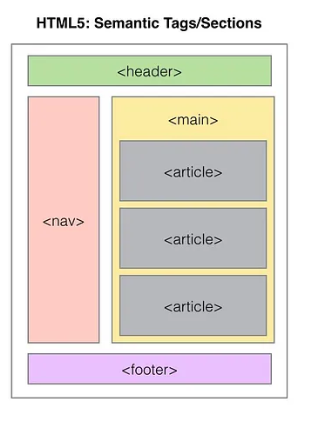

# Teorihandboken - HTML & CSS (HC)
Studerande: Shaker Nasser 
## HC 1.1 HTML & CSS
HTML ( HypText Markup Language)

Standariserat märkspråk som används för att skapa webbsidor och kännetecknas som grundstenen i webbutveckling. Språket i sig använda för att skapa struktur i webbsidor. HTML gör att mölijgt att kunna definera dem olika momenten i en webbsida och bestämma hur de ska vara organiserade och relaterade till varandra. 
I ett HTML dokument så presenteras serie av element. Dem elementen presenteras av en starttag <"tag"> och en sluttag </tag>. Dessa taggar används för att definera dem olika delar av innehållet.  

## HC 1.2 Responsiv design
Beskriv rubriken här

## HC 1.3 Tillgänglighet inom webb
Beskriv rubriken nedan här

## HC 1.4 Aktuella webbstandarder (gällande och kommande standarder)
Beskriv rubriken nedan här

## HC 1.5 CSS Pre-processorer (ex SASS/LESS)
Beskriv rubriken nedan här

## HC 1.6 Optimering och validering av HTML & CSS
Beskriv rubriken nedan här
