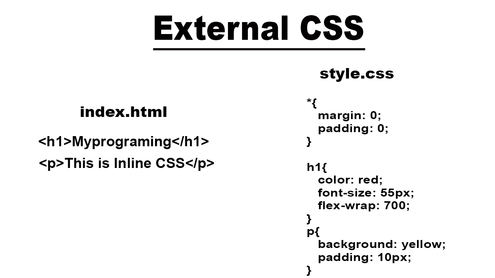
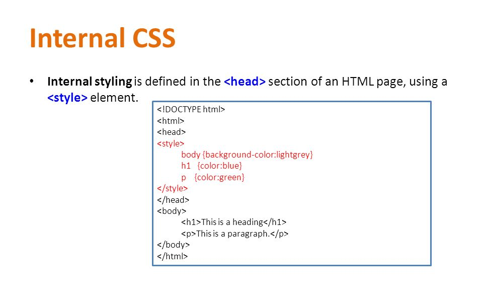
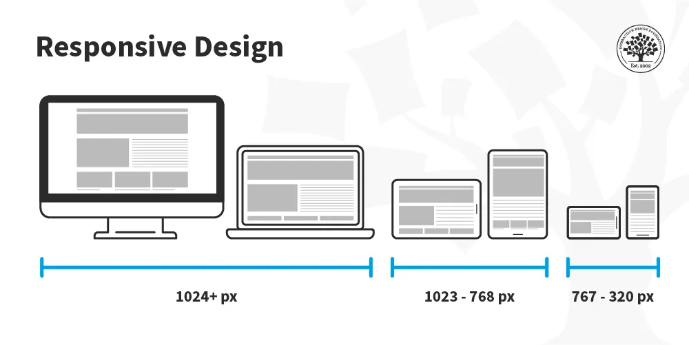
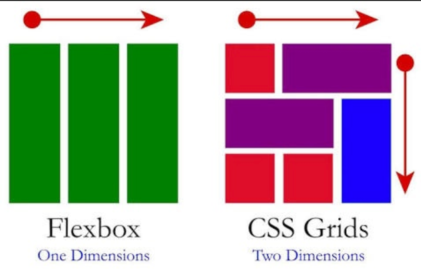
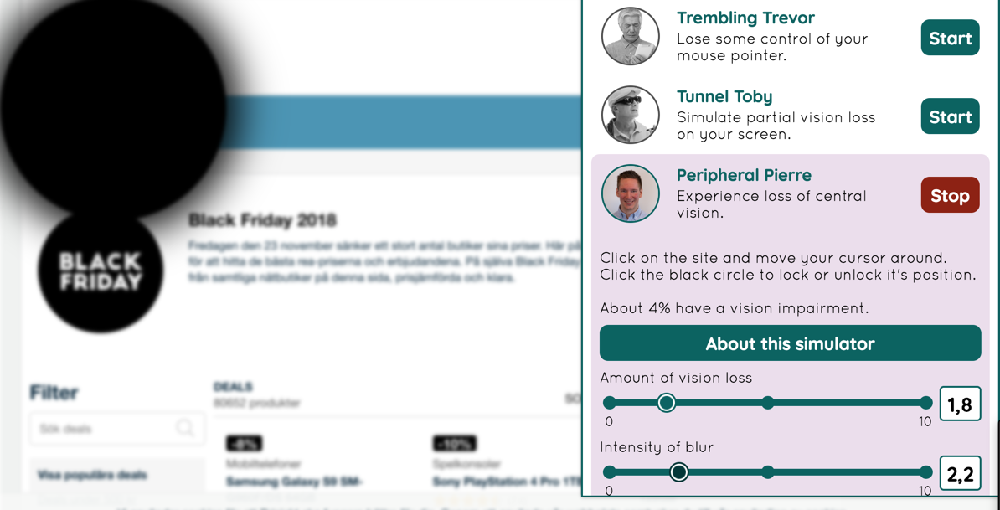
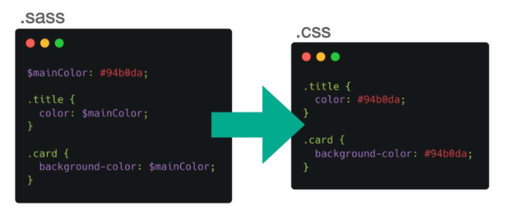
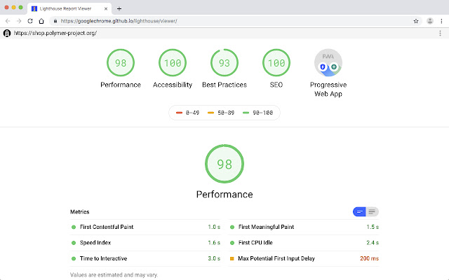
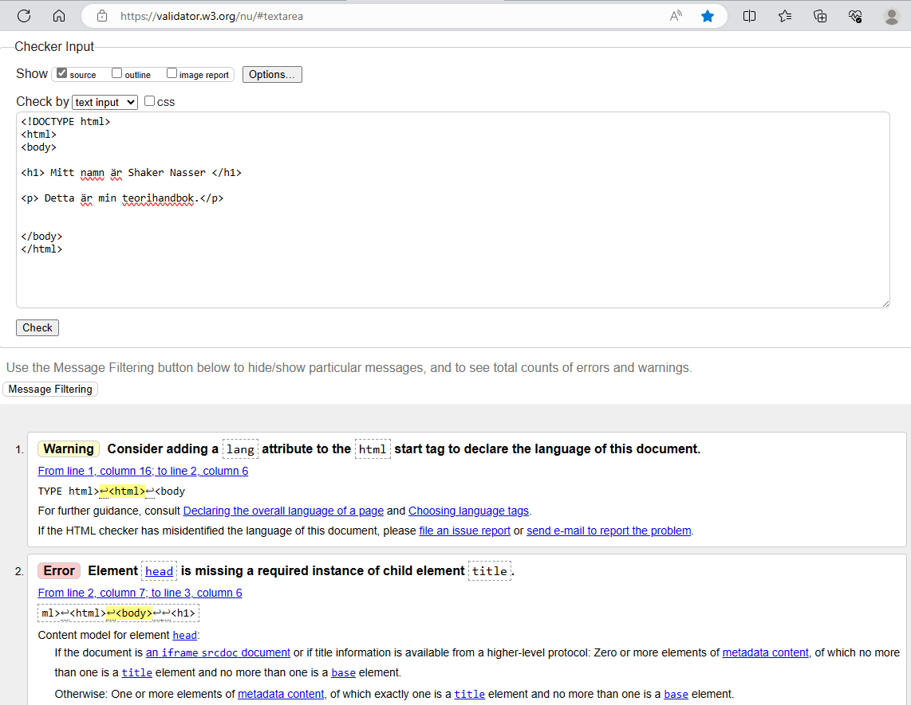
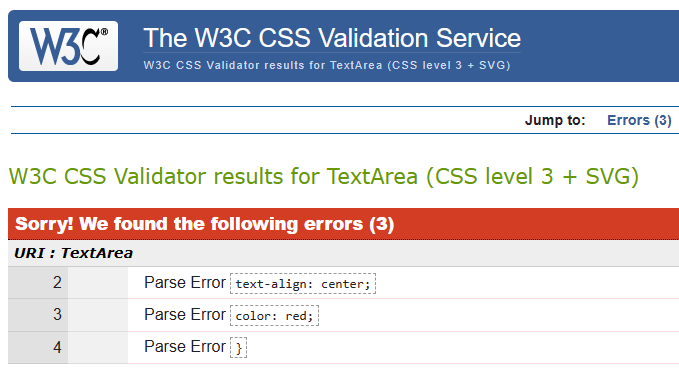

# Teorihandboken - HTML & CSS (HC)
Studerande: Shaker Nasser 

## HC 1.1 HTML & CSS
HTML (HyperText Markup Language)

HTML är ett märkspråk som används för att skapa webbsidor och kännetecknas som grundstenen i webbutveckling. Språket i sig används för att skapa struktur i webbsidor. HTML gör det att möjligt att kunna definiera dem olika momenten i en webbsida och bestämma hur de ska vara organiserade och relaterade till varandra. Språket är utvecklad för att båda kunna läsas strukturellt av maskindatorer och människor. 

HTML har haft flera förändringar sedan första produkt lansering under år 1993.Den nuvarande versionen vi använder oss av går under namnet HTML 5. Syftet med HTML5 var att förbättra och mordranisera webbstandarderna för att möta de ökande kraven och behoven hos den moderna webben. Detta ger utvecklare kraftfulla verktyg för att skapa rikare och mer interaktiva och tillgänligsbara webbapplikationer och webbsidor.

I ett HTML dokument så presenteras serie av element. Dem elementen presenteras av en starttagg ```<tag>``` och en sluttag ```</tag>``` av dem olika delar av innehållet. Inom starttagg och sluttag presenteras ett attribut och innehåll. 

I HTML så finns det även andra funktioner som förenklar dokumentationen och felsökningen. Detta genom att kommentera. Kommentaren ignoneras av webbläsaren och är osynlig för användaren. Många utvecklare använder detta för att förklara sina koder för andra utvecklare eller använda det som egen notering. Väldigt användarbart vid överlämningar av sin kod till andra eller vill kunna förstå sin kod till senare, tex om man åker på semester och sedan ska behöva återta det projektet.  

Semantik i HTML handlar om att använda taggar på ett sätt som ger en meningsfull struktur och betydelse åt innehållet på en webbsida. Det hjälper både människor och maskindatorer (webbläsare) att förstå hur olika delar av webbsidan är relaterade till varandra.
Att använda semantisk HTML är en god praxis inom webbutveckling och bidrar till en bättre användarupplevelse och tillgänglighet.


CSS (Cascading Style Sheets)

Medan HTML fokuserar på struktur och innehåll, är CSS ansvarigt för presentation och utseende. CSS står för Cascading Style Sheets och gör det möjligt för utvecklare att definiera hur HTML-element ska visas på en webbsida. CSS är i sin tredje interation och går under namnet CSS3. 

Genom CSS kan webbutvecklare ändra egenskaper som färg, typsnitt, storlek och positionering av element. Detta görs genom att använda selektorer för att välja specifika HTML-element och sedan tillämpa dem stilregler.

Utvecklaren har även möjlgihet till att använda shorthand (istället för att upprepa sig) när det gäller placering av margin/paddingen. Enklaste sättet är att tänka på hur en klocka fungerar och utgå från att dessa ska tillämpas: 


En typisk CSS-regel består av en selektor och en uppsättning deklarationer.
CSS erbjuder även möjligheten att använda hierarki. Om två eller flera regler konflikterar, tillämpas den med högre specificitet eller den som deklarerades senast.

I HTML:

```
<p>Chas Academy is the best.</p>
```

I CSS: 

```
p {
  text-align: center;
  color: red;
} 
```
Här deklerar vi var ```<p> ``` skall vara placerad och vilken färg den skall visas. 

Inom CSS går det att arbeta med olika praxis. Inline CSS och extern CSS är en av dem praxisen. Inline CSS syftar på användningen av stilregler och definitioner som direkt infogas i HTML-elementets attribut, istället för att placeras i en separat extern CSS-fil. Extern CSS innebär att man jobbar i en extern CSS fil sepeterat från HTML- dokumentet. Detta tillvägagångssätt hjälper till med att separera innehållet från presentationen. Vilket gör koden mer organiserad och lättläst.

För att skapa en komplett webbsida måste HTML och CSS integreras. Detta görs genom att länka en CSS-fil i HTML-dokumentet med en -tagg i -sektionen. Detta tillåter CSS-filen att styras av HTML och därigenom kontrollera utseendet på webbsidan.




1. https://www.hostinger.com/tutorials/what-is-html
2. https://www.hostinger.com/tutorials/what-is-css
3. https://codeinstitute.net/se/blog/what-is-html-and-why-should-i-learn-it/
4. https://codeinstitute.net/se/blog/what-is-css-and-why-should-i-learn-it/
5. Booken HTML & CSS (design and build websites) ISBN: 97811188871645

## HC 1.2 Responsiv design

Responsiv design är en metod inom webbutveckling som fokuserar på att skapa webbsidor eller applikationer som anpassar sig och verkar visuellt tillämpade över olika enheter och skärmstorlekar. Den uppnår detta genom olika viktiga aspekter.

För det första är flexibilitet en huvud aspekt av responsiv design. Det låter innehållet på en webbsida ändra position, storlek och utseende beroende på vilken enhet som används. Detta säkerställer att layouten förblir anpassningsbar till olika skärmstorlekar.

Mediefrågor som är CSS-tekniker. Dem spelar en viktig roll i responsiv design. Dessa frågor ändrar layouten baserat på egenskaper som skärmstorlek, upplösning och visningsenhetens orientering.

Såhär kan en media fråga se ut: 

``` 
@media screen and (max-width: 992px) {
  body {
    background-color: blue;
  }
}
```

Istället för fasta mått i pixlar använder responsiv design ofta procentenheter eller relativa enheter som % eller em för att indikera dimensioner. Denna flytande layout gör att designen kan anpassas till olika skärmstorlekar.

Bildoptimering är en annan viktig aspekt av responsiv design. Det handlar om att optimera bilder för olika enheter och skärmupplösningar. Tekniker som att använda olika bildfiler eller implementera srcset (source) och storlekar i HTML används ofta.



Prioritering i innehållet är en viktig faktor vid responsiv design. Det handlar om att identifiera det mest relevanta och viktiga innehållet för användare baserat på deras enhet och skärmstorlek. Det kan handla om att prioritera vissa element eller dölja specifika detaljer på mindre skärmar.

Flexbox och grid är också viktiga aspekter i en responsiv design. Dessa layoutmodeller ger utvecklare avancerade verktyg för att skapa komplexa och flexibla layouter. Flexbox är perfekt för att hantera element i en endimensionell riktning, medan grid möjliggör en tvådimensionell layout och möjliggör exakt placering av element i ett rutnät. Med dessa tekniker kan utvecklare skapa gränssnitt som smidigt anpassar sig till olika skärmstorlekar.



Förutom estetiken (utseende) är responsiv design avgörande av andra skäl. Den förbättrar användarupplevelsen genom att ge en konsekvent och användarvänlig upplevelse på alla enheter. Detta uppmuntrar besökare att stanna längre på webbplatsen och utforska dess innehåll. Dessutom tenderar responsiva webbplatser att rankas högre i sökmotorresultaten (SEO) på grund av sin mobilvänlighet, vilket ökar synligheten och ökar trafiken.

Även här är bildoptimering en viktig del av responsiv design och säkerställer optimal prestanda på olika enheter. Flexbox och grid ger utvecklare kraftfulla verktyg för att skapa komplexa layouter som anpassar sig. Responsiv design förbättrar inte bara användarupplevelsen utan även sökmotorrankingen, vilket gör den till en viktig del av den digitala marknadsföringen.

1. https://developer.mozilla.org/en-US/docs/Web/CSS/CSS_flexible_box_layout/Basic_concepts_of_flexbox
2. https://developer.mozilla.org/en-US/docs/Learn/CSS/CSS_layout/Responsive_Design
3. https://developer.mozilla.org/en-US/docs/Glossary/SEO

## HC 1.3 Tillgänglighet inom webb

Webben är en ständigt föränderlig och utvecklande plattform som är central i vårt dagliga liv. Alla har dock inte samma tillgång till webbinnehåll. Olika användare har varierande behov och omständigheter som påverkar deras förmåga att interagera med webbplatser. För att hantera detta är initiativ som ARIA, WAI-ARIA, A11y, WCAG och inbyggda skärmläsare mycket viktiga.

ARIA är en teknik som ger ytterligare information om webbsidors tillgänglighet för användare med funktionsnedsättning. Den gör det möjligt för utvecklare att beskriva interaktiva element och dynamiska innehållsuppdateringar så att de är tillgängliga för alla. WAI-ARIA, som är en del av World Wide Web Consortium (W3C), utvecklar riktlinjer och specifikationer för att förbättra webbtillgängligheten, inklusive tekniker för att beskriva interaktiva element och navigeringsmönster.

A11y är ett åtagande att skapa produkter och tjänster som är tillgängliga för alla. Det fokuserar på att integrera tillgänglighetsprinciper i design- och utvecklingsprocessen. WCAG, som fastställts av W3C, innehåller riktlinjer för bedömning av webbsidors tillgänglighet och tar upp perceptuell, kognitiv och motorisk tillgänglighet.

Inbyggda skärmläsare är avgörande för att personer med synnedsättning ska få tillgång till webbinnehåll. Dessa program omvandlar visuellt innehåll till talat eller taktilt format. Utvecklare måste utforma sina webbsidor så att de är kompatibla med skärmläsare för korrekt tolkning.

Sammanfattningsvis är webben en kraftfull plattform som berikar våra liv, men alla användare har inte samma möjligheter att få tillgång till dess innehåll. Initiativ som ARIA, WAI-ARIA, A11y, WCAG och inbyggda skärmläsare spelar en avgörande roll för att främja webbtillgänglighet och skapa en inkluderande digital värld för alla.

Funkify är en en extension för Google Chrome som gör att man kan uppleva hur andra människor med funktionsnedsättningar kan uppleva interaktionen med webbläsaren som användare. Här nedan så kan vi se ett exempel från funkify simulator på hur någon med minskad central syn kan vara: 



1. https://webbriktlinjer.se/principer/tillganglig/
2. http://www.w3c.se/resources/office/translations/wai/intro/accessibility.html
3. https://medarbetare.ki.se/tillganglighet-pa-webben-vad-kravs-av-dig-som-uppdaterar-innehall

## HC 1.4 Aktuella webbstandarder (gällande och kommande standarder)

Webbstandarder är viktiga eftersom de hjälper till att skapa en mer tillgänglig, användarvänlig och hållbar webb. Genom att följa webbstandarder kan webbutvecklare skapa webbsidor som är lättare att underhålla, snabbare att ladda och mer sökmotorvänliga. Webbstandarder gör det också möjligt för personer med funktionsnedsättningar att använda webben på ett effektivt sätt genom att tillhandahålla stöd för hjälpmedel som skärmläsare.

Dem allmänna webbriktlinjer rekomenderar att man använder sig av HTML5 versionen som blev en "W3C Recommendation" i Oktober 2014. 
CSS3 är den senaste versionen av Cascading Style Sheets och möjliggör avancerade stil- och layoutmöjligheter för webbsidor. Det inkluderar övergångar, animationer och flexbox-layouter.

När det kommer till att optimera sin kod finns det faktiskt en hel del fördelar. Webbsidan kommer att laddas mycket snabbare i webbläsaren. Dessutom kommer den att rankas högre i sökmotorer, vilket är bra för din synlighet online. 

Ett användbart tips är att utforska Chrome DevTools Lighthouse. Där kan man testa prestandan och få en lista över saker du kan förbättra på din webbsida.


Inom kommande webbstanarder så jobbar man väldigt mycket på att utveckla hur man kan ge användaren möljghet till använda webbsidor för att fungera offline, erbjuda snabbare laddningstider och ge användare en app-liknande upplevelse direkt från webbläsaren. Dessa går under namnet Service Workers och Progressive Web Apps (PWAs)

Att validera kod innebär att försäkra om att den följer de bästa praxis som W3C rekommenderar. En kod som klarar valideringen är oftast också mer optimerad. Dessutom hjälper validering att förbättra SEO resultatet, hitta fel i koden, öka användarvänligheten och tillgängligheten, samt se till att webbsidan fungerar på olika enheter.

1. https://webbriktlinjer.se/riktlinjer/54-optimera-webbplatsen-for-basta-prestanda/
2. https://web.dev/learn/pwa/service-workers
3. https://developer.mozilla.org/en-US/docs/Web/Progressive_web_apps/Tutorials/js13kGames/Offline_Service_workers

## HC 1.5 CSS Pre-processorer (ex SASS/LESS)

Användning av CSS pre-processorer utgör en värdefull lösning för att effiktiversa hanteringen av stilregler och minska behovet av omfattande ramverk inom CSS. Genom att sammansmälta pre-processorer som LESS (Leaner Style Sheets), Sass (Syntactically Awesome Stylesheets), Stylus och den mer avancerade PostCSS, kan webbutvecklare effektivisera sin arbetsprocess.

Traditionell CSS-implementering kräver att specifika värden upprepas gång på gång, vilket kan leda till onödigt komplexa och tidskrävande kodbaser. Med CSS pre-processorer kan dessa värden definieras som variabler och återanvändas i hela projektet. Detta inte bara minskar risken för fel, utan sparar också värdefull tid som annars skulle ha spenderats på att upprepa liknande koder.

En av de mesta fördelarna med pre-processorer är möjligheten att nästa CSS-regler. Genom att organisera koden på ett strukturerat sätt, blir den mer läsbar och underlättar underhållet över tid. Denna hierarkiska struktur skapar en översiktlig och intuitiv kodbas, vilket i sin tur förenklar samarbete och förståelse mellan utvecklare. 



Dessutom minskar användningen av pre-processorer beroendet av att förlita sig på andras lösningar och ökar därmed utvecklarens självständighet. Genom att skapa sina egna regler och definiera specifika stilparametrar, ökar utvecklarens kontroll över design och layout. 

Användningen av CSS pre-processorer en betydande framsteg inom webbutveckling, vilket leder till mer effektiv och strukturerad kod. Genom att minska upprepningar och frigöra utrymme för kreativitet, möjliggör pre-processorer för utvecklare att skapa webbsidor och applikationer som är både stilistiskt enhetliga och lättlästa.
Både Sass och Less är övermängder av vanlig CSS, vilket innebär att giltig CSS automatiskt är giltig i båda preprocessorer. Valet mellan Sass och Less beror slutligen på personliga preferenser och projektets krav.

1. https://developer.mozilla.org/en-US/docs/Glossary/CSS_preprocessor
2. https://www.freecodecamp.org/news/how-to-use-sass-with-css/
3. https://developer.mozilla.org/en-US/docs/Web/CSS

## HC 1.6 Optimering och validering av HTML & CSS

Optimering och validering utgör en en stor del i en välfungerande webbplats. Att förstå och tillämpa bästa praxis för HTML (HyperText Markup Language) och CSS (Cascading Style Sheets) är avgörande för att skapa snabba, tillgängliga och sökmotorvänliga webbsidor.git

När man pratar om optimering så pratar man oftast om optimering av resurser och optimering av innehåll. Optimering av resurser grundad bakom studier om hur användaren inte har tålamod och det digitala ska ske under en snabb respons. Svarstiden ska göra så att användaren vill uppehålla sig i webbsidan och inte behöva uppsöka andra sidor. I resurs menar man dem filerna som används för att bygga en webbsida så som: .HTML, .CSS, .JPG och flera andra filer. Optimering av resurser kan ske genom att man minskar storleken på bilderna och använda sig av ikoner istället för bilder. Genom användning av rätta filformat och inte avända sig av högkvalitiva bilder. 

LightHouse är en verktyg utvecklad av Google för att mäta och förbättra prestanda, tillgänglighet, användbarhet och sökbarhet på webbsidor. Genom att använda Lighthouse kan webbutvecklare och webbdesigners få värdefulla insikter och rekommendationer för att förbättra kvaliteten och prestandan på sina webbsidor. 



Validering är processen att kontrollera att koden följer de standarder och riktlinjer som fastställts av W3C (World Wide Web Consortium). För HTML finns det verktyg som W3C Validator som kan användas för att kontrollera om koden är korrekt formaterad. Validering hjälper till att upptäcka och åtgärda potentiella fel och säkerställer att webbsidan fungerar korrekt på olika webbläsare och enheter.

Här är en användbar verktyg utvecklad av W3C: https://validator.w3.org/
Verktygen gör validerar koden och ger förslag på förbättring av html-koden. 


För CSS finns även valideringsverktyg som hjälper till att identifiera syntaktiska fel och ogiltiga kodsyntax. Att ha giltig CSS-kod är avgörande för att säkerställa en enhetlig och pålitlig visuell upplevelse på olika plattformar.

Här är en användbar verktyg utvecklad av W3C: https://jigsaw.w3.org/css-validator/
Verktygen gör validerar koden och ger förslag på förbättring av css-koden. 



Optimering och validering av HTML & CSS är grundläggande principer för att skapa högpresterande och pålitliga webbplatser. Genom att följa bästa praxis för kodoptimering och använda valideringsverktyg kan utvecklare säkerställa att deras webbsidor är snabba, tillgängliga och kompatibla på olika plattformar. Detta är avgörande för att skapa en positiv användarupplevelse och maximera webbplatsens effektivitet.

1. https://webbriktlinjer.se/riktlinjer/81-utveckla-webbplatsen-enligt-en-standard-snarare-an-for-en-webblasare/
2. https://developer.mozilla.org/en-US/docs/Learn/Performance/CSS
3. https://developer.mozilla.org/en-US/docs/Learn/Performance/HTML
