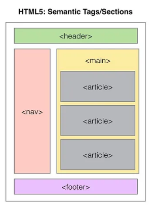
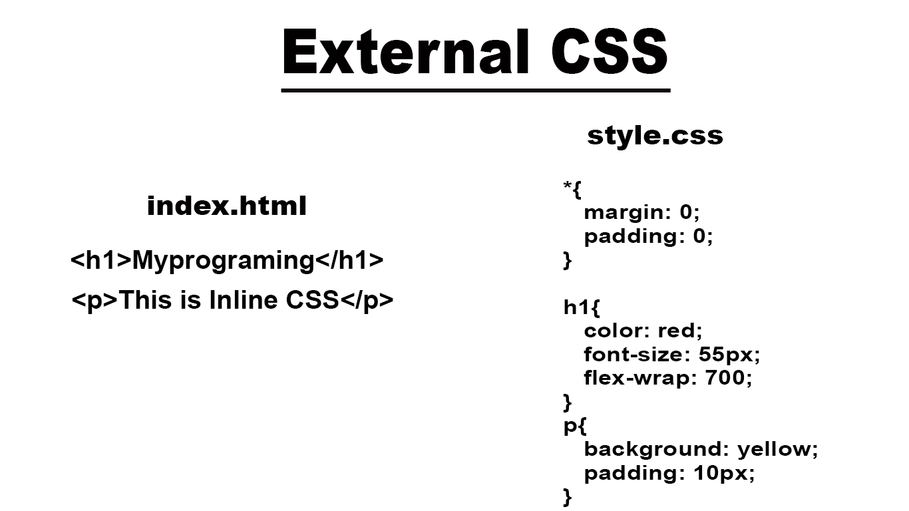
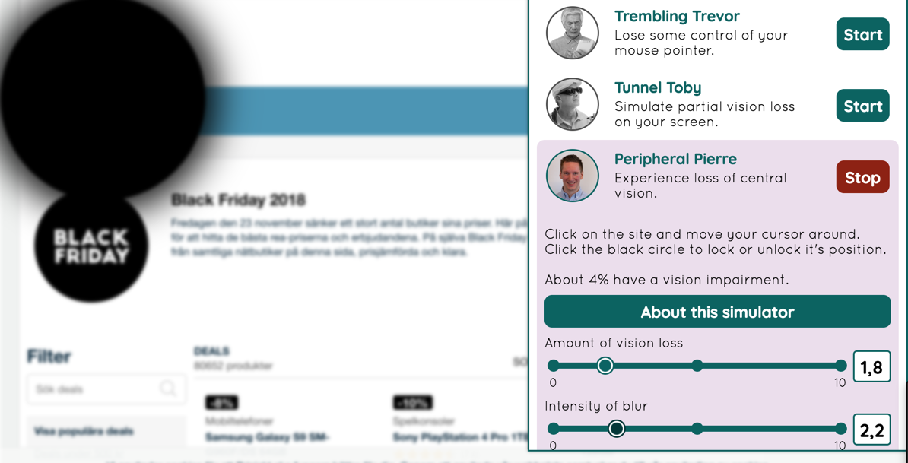

# Teorihandboken - HTML & CSS (HC)
Studerande: Shaker Nasser 

## HC 1.1 HTML & CSS
HTML ( HyperText Markup Language)

HTML är standardiserat märkspråk som används för att skapa webbsidor och kännetecknas som grundstenen i webbutveckling. Språket i sig används för att skapa struktur i webbsidor. HTML gör det att möjligt att kunna definiera dem olika momenten i en webbsida och bestämma hur de ska vara organiserade och relaterade till varandra. Märkspråket är utvecklad för att båda kunna läsas strukturellt av maskindatorer och människor. HTML har haft flera förändringar sedan första lanseringen under år 1993.Den nuvarande versionen vi använder oss av går under namnet HTML 5. Syftet med HTML5 var att förbättra och modernisera webbstandarderna för att möta de ökande kraven och behoven hos den moderna webben. Det ger utvecklare kraftfulla verktyg för att skapa rikare och mer interaktiva och tillgänligsbara webbapplikationer och webbsidor.

I ett HTML dokument så presenteras serie av element. Dem elementen presenteras av en starttagg <"tag"> och en sluttag <"/tag">. Dessa taggar används för att definiera dem olika delar av innehållet. Inom starttagg och sluttag presenteras ett attribut och innehåll. 

I HTML så finns det även andra funktioner som förenklar dokumentationen och felsökningen. Detta genom att kommentera, ignoneras av webbläsaren och är osynlig för användaren. Många utvecklare använder detta för att förklara sina koder för andra utvecklare eller använda det som egen notering. Väldigt användarbart vid överlämningar av sin kod till andra. 

Semantik i HTML handlar om att använda taggar på ett sätt som ger en meningsfull struktur och betydelse åt innehållet på en webbsida. Det hjälper både människor och maskindatorer (webbläsare) att förstå hur olika delar av webbsidan är relaterade till varandra.
Att använda semantisk HTML är en god praxis inom webbutveckling och bidrar till en bättre användarupplevelse och tillgänglighet.

CSS (Cascading Style Sheets)

Medan HTML fokuserar på struktur och innehåll, är CSS ansvarigt för presentation och utseende. CSS står för Cascading Style Sheets och gör det möjligt för utvecklare att definiera hur HTML-element ska visas på en webbsida. CSS är i sin tredje interation och går under namnet CSS3. 

Genom CSS kan utvecklare ändra egenskaper som färg, typsnitt, storlek och positionering av element. Detta görs genom att använda selektorer för att välja specifika HTML-element och sedan tillämpa dem stilregler.

En typisk CSS-regel består av en selektor och en uppsättning deklarationer.
CSS erbjuder även möjligheten att använda hierarki. Om två eller flera regler konflikterar, tillämpas den med högre specificitet eller den som deklarerades senast.

Inom CSS går det att arbeta med olika praxis. Inline CSS och extern CSS är en av dem praxisen. Inline CSS syftar på användningen av stilregler och definitioner som direkt infogas i HTML-elementets attribut, istället för att placeras i en separat extern CSS-fil. Extern CSS innebär att man jobbar i en extern CSS fil sepeterat från HTML- dokumentet. Detta tillvägagångssätt hjälper till med att separera innehållet från presentationen, vilket gör koden mer organiserad och lättläst.

För att skapa en komplett webbsida måste HTML och CSS integreras. Detta görs genom att länka en CSS-fil i HTML-dokumentet med en -tagg i -sektionen. Detta tillåter CSS-filen att styras av HTML och därigenom kontrollera utseendet på webbsidan.

Sammanfattningsvis är HTML och CSS två av de viktigaste verktygen för webbutveckling. HTML används för att definiera strukturen och innehållet på en webbsida medan CSS hanterar presentationen och utseendet.

1. https://www.hostinger.com/tutorials/what-is-html
2. https://www.hostinger.com/tutorials/what-is-css
3. https://codeinstitute.net/se/blog/what-is-html-and-why-should-i-learn-it/
4. https://codeinstitute.net/se/blog/what-is-css-and-why-should-i-learn-it/

## HC 1.2 Responsiv design

Responsiv design är en designmetod inom webbutveckling som fokuserar på att skapa webbsidor eller applikationer som anpassar sig och verkar visuellt tillämpade över olika enheter och skärmstorlekar. Den uppnår detta genom olika viktiga aspekter.

För det första är flexibilitet en nyckelaspekt av responsiv design. Det låter innehållet på en webbsida ändra position, storlek och utseende beroende på vilken enhet som används. Detta säkerställer att layouten förblir anpassningsbar till olika skärmstorlekar.

Mediefrågor som är CSS-tekniker, spelar en viktig roll i responsiv design. Dessa frågor ändrar layouten baserat på egenskaper som skärmstorlek, upplösning och visningsenhetens orientering.

Istället för fasta mått i pixlar använder responsiv design ofta procentenheter eller relativa enheter som % eller em för att indikera dimensioner. Denna flytande layout gör att designen kan anpassas till olika skärmstorlekar.

Bildoptimering är en annan viktig aspekt av responsiv design. Det handlar om att optimera bilder för olika enheter och skärmupplösningar. Tekniker som att använda olika bildfiler eller implementera srcset och storlekar i HTML används ofta.

Responsiv design tar också hänsyn till beröringsanpassning för mobila enheter. Detta inkluderar inkorporering av större knappar och interaktiva element som är lätta att röra med ett finger.

Innehållsprioritering är en viktig faktor vid responsiv design. Det handlar om att identifiera det mest relevanta och viktiga innehållet för användare baserat på deras enhet och skärmstorlek. Det kan handla om att prioritera vissa element eller dölja specifika detaljer på mindre skärmar.

Flexbox och grid är också viktiga aspekter av responsiv design. Dessa layoutmodeller ger utvecklare avancerade verktyg för att skapa komplexa och flexibla layouter. Flexbox är perfekt för att hantera element i en endimensionell riktning, medan grid möjliggör en tvådimensionell layout och möjliggör exakt placering av element i ett rutnät. Med dessa tekniker kan utvecklare skapa dynamiska gränssnitt som smidigt anpassar sig till olika skärmstorlekar.

Förutom estetiken är responsiv design avgörande av andra skäl. Den förbättrar användarupplevelsen genom att ge en konsekvent och användarvänlig upplevelse på alla enheter. Detta uppmuntrar besökare att stanna längre på webbplatsen och utforska dess innehåll. Dessutom tenderar responsiva webbplatser att rankas högre i sökmotorresultaten (SEO) på grund av sin mobilvänlighet, vilket ökar synligheten och ökar trafiken.

Sammanfattningsvis är bildoptimering en viktig del av responsiv design och säkerställer optimal prestanda på olika enheter. Flexbox och grid ger utvecklare kraftfulla verktyg för att skapa komplexa layouter som anpassar sig sömlöst. Responsiv design förbättrar inte bara användarupplevelsen utan även sökmotorrankingen, vilket gör den till en viktig del av den digitala marknadsföringen.

## HC 1.3 Tillgänglighet inom webb

Webben är en plats för information, interaktion och kommunikation som är i ständig förändring och utveckling. Den har blivit en del av våra liv och används i en mängd olika syften, från att söka information till att delta i sociala nätverk och utföra komplexa uppgifter som online-shopping och bankärenden. Vi tar lätt webbens tillgänglighet för givet, men det är viktigt att komma ihåg att för många är tillgången till webbinnehåll inte alltid lika smidig som för andra.

Det finns en bred variation av användare med olika behov och förutsättningar när de konsumerar webbinnehåll. För vissa kan det handla om att ha en funktionsnedsättning som påverkar deras förmåga att interagera med webbsidor på det traditionella sättet. För andra kan det vara relaterat till tekniska begränsningar på deras enheter eller internetuppkoppling. Att förstå och adressera dessa varierande behov är avgörande för att säkerställa att webben är tillgänglig för alla, oavsett deras individuella förutsättningar.

För att främja en mer inkluderande och tillgänglig webb har initiativ som ARIA (Accessible Rich Internet Applications), WAI-ARIA (Web Accessibility Initiative - Accessible Rich Internet Applications), A11y (förkortning för "accessibility", vanligt i nätgemenskapen) och WCAG (Web Content Accessibility Guidelines) blivit avgörande. Dessa initiativ syftar till att skapa riktlinjer, tekniker och verktyg för utvecklare och webbdesigners för att göra sina webbsidor och applikationer tillgängliga för så många användare som möjligt.

ARIA är en teknik som gör det möjligt att tillföra ytterligare information om användbarheten och tillgängligheten av webbsidor för användare som använder hjälpmedel som skärmläsare eller tangentbord för att navigera. Det gör det möjligt för utvecklare att beskriva interaktiva element, widgets och dynamiska innehållsuppdateringar så att de blir tillgängliga för personer med funktionsnedsättningar.

WAI-ARIA är en del av W3C (World Wide Web Consortium) och arbetar för att utveckla riktlinjer och specifikationer för att förbättra webbens tillgänglighet. Dessa inkluderar tekniker för att beskriva interaktiva element och navigationsmönster, vilket möjliggör en mer detaljerad och precis tolkning av webbsidor för användare med funktionsnedsättningar.

A11y är en förkortning som används för att hänvisa till tillgänglighet i webbutvecklings- och designgemenskapen. Den representerar ett åtagande att skapa produkter och tjänster som är tillgängliga för alla, oavsett deras förmåga eller funktionsnedsättning. A11y fokuserar på att integrera principer för tillgänglighet i varje steg av design- och utvecklingsprocessen.

WCAG är en uppsättning riktlinjer som fastställs av W3C och utgör en referenspunkt för att bedöma webbsidors tillgänglighet. Dessa riktlinjer adresserar olika aspekter av webbinnehåll, inklusive perceptuell, kognitiv och motorisk tillgänglighet. Genom att följa WCAG riktlinjer kan utvecklare skapa webbsidor som är tillgängliga för en bredare publik.

Inbyggda skärmläsare, eller screen readers, utgör en komponent i att göra webben tillgänglig för personer med synnedsättningar. Dessa programvaror tolkar visuellt webbinnehåll och omvandlar det till talat eller taktilt format. Användare med synnedsättningar kan därmed navigera och konsumera webbsidor med hjälp av ljudmeddelanden eller taktila återkopplingar som genereras av skärmläsaren. Det är avgörande för utvecklare att utforma sina webbsidor på ett sätt som gör dem kompatibla med dessa skärmläsare, så att de kan tolka innehållet korrekt och göra det tillgängligt för användare med synnedsättningar.

Funkify är en en extension för Google Chrome som gör att man kan uppleva hur andra människor med funktionsnedsättningar kan uppleva interaktionen med webbläsaren under som användare. Här nedan så kan vi se ett exempel från funkify simulator på hur någon med minskad central syn kan vara: 

Sammanfattningsvis är webben en kraftfull plattform för kommunikation och informationstillgänglighet som berikar våra liv. Det är viktigt att komma ihåg att inte alla användare har samma förutsättningar för att ta del av webbinnehållet. Initiativ som ARIA, WAI-ARIA, A11y, WCAG och inbyggda skärmläsare spelar en avgörande roll i att främja webbens tillgänglighet och säkerställa att den är öppen för alla, oavsett deras individuella behov och förutsättningar. Dessa insatser är avgörande för att skapa en inkluderande digital värld där varje individ har möjlighet att dra nytta av webbens rikedom och möjligheter.

## HC 1.4 Aktuella webbstandarder (gällande och kommande standarder)
Beskriv rubriken nedan här

## HC 1.5 CSS Pre-processorer (ex SASS/LESS)
Beskriv rubriken nedan här

## HC 1.6 Optimering och validering av HTML & CSS
Beskriv rubriken nedan här
