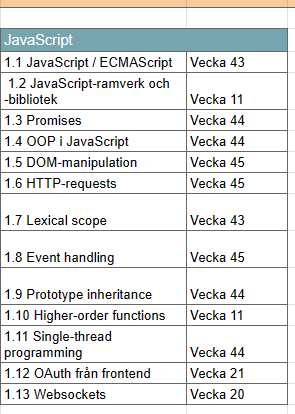

# Teorihandboken - JavaScript (JS)
Studerande Shaker Nasser

## JS 1.1 JavaScript / ECMAScript

Javascript är ett programmeringsspråk som utgavs 1995 och skapades av Brendan Eich och utvecklades tillsammans med många andra utvecklare. Programmeringsspråket utgör funktionalitet till webbsidor och gör dem dynamiska. Javascript tillsammans med HTML och CSS utgör dem tre grundläggande byggstenar i en dymanisk och full funktionuell webbsida. För att enklare kunna förklara javacript så kan man förklara med vad som "händer" på en webbsida när man navigerar, fyller i formulär eller trycker på en knapp. Javascripts vanligaste användningsområden är att det bestämmer vad som händer när användaren intergerar på olika sätt.

För att koden skall köras på ett rätt sätt så ska man definera variabler i dem ordningen som koden skall köras. Detta gör man pga att JavaScript läser koden uppifrån och nedåt.
En variabel är en placeholder för en typ av datatyp/värde. I Javascript finns det följande varibaler:
Automatically
- Using var (äldre webbläsare) 
- Using let
- Using const

Dessa datatyper/värden finns i JavaScript: 

- String
- Boolean
- Number
- Array
- Object
- Undefined
- Null

Här nedan följer ex på hur koden exkeveras (körs) med hjälp av console.log funktionen. 

```
let x = 1
console.log(x)
```

Javascript har väldigt många funktioner, en av dem mesta användabara i den nuvarande webbutveckling är API:er. Vi använder API:er i tex väderprogonos webbsidor (Klart.se) eller tex  bilupplysningssidor (biluppgifter.se)
Dessa webbsidor hämtar information från en annan källa. Dett kallas för Applikationsprogrammeringsgränssnitt. JavaScript underlättar hämtning av API:er som kan matas ut i HTML format som visas till användaren.

Genom att lägga till evenlistners så blir interagtionen dynamisk med användaren. En eventlistener är en funktion som lyssnar efter en specifik händelse på en webbsida, till exempel en klick på en knapp eller en muspekare som rör sig över en bild. När händelsen inträffar, exekveras den kod som är kopplad till eventlistenern.

```
element.addEventListener(event, function);

```

ECMAScript (förkortat ES) är en standard för skriptspråk och används huvudsakligen för att definiera JavaScript. ECMAScript-standarden har utvecklats av organisationen Ecma International och syftar till att standardisera kärnan i JavaScript för att säkerställa att olika webbläsare kan tolka och köra JavaScript på ett enhetligt sätt.

Skillnaden mellan ECMAScript och JavaScript är subtil eftersom JavaScript är en praktiskt genomförande av ECMAScript-standarden. ECMAScript kan ses som den formella specifikationen, medan JavaScript är den mest kända genomförandet av denna specifikation. Termerna används ofta utbytbart, och i praktiken hänvisar de oftast till samma sak, särskilt när det gäller webbutveckling.

Nya versioner av ECMAScript släpps med nya funktioner och förbättringar. Till exempel används termen "ES6" ofta för att referera till ECMAScript 2015, som var en betydande uppdatering med många nya funktioner som arrow functions, template literals och block scope variables. Det är viktigt för utvecklare att hålla sig uppdaterade med de senaste versionerna av ECMAScript för att dra nytta av dess förbättringar och kunna skriva modern och effektiv JavaScript-kod.

1. https://www.exsitec.se/blogg/vad-ar-javascript
2. https://www.freecodecamp.org/news/javascript
3. Bok Eloquent JavaScript - Third Edt. - Marijn Haverbeke ISBN: 8006636608372

## JS 1.2 JavaScript-ramverk och -bibliotek

Beskriv rubriken här

## JS 1.3 Promises

Beskriv rubriken här

## JS 1.4 OOP i JavaScript


## JS 1.5 DOM-manipulation

Beskriv rubriken här

## JS 1.6 HTTP-requests

Beskriv rubriken här

## JS 1.7 Lexical scope

Beskriv rubriken här

## JS 1.8 Event handling

Beskriv rubriken här

## JS 1.9 Prototype inheritance

Beskriv rubriken här

## JS 1.10 Higher-order functions

Beskriv rubriken här

## JS 1.11 Single-thread programming

Beskriv rubriken här

asynkrona metoder

## JS 1.12 OAuth från frontend

Beskriv rubriken här

## JS 1.13 Websockets

Beskriv rubriken här
