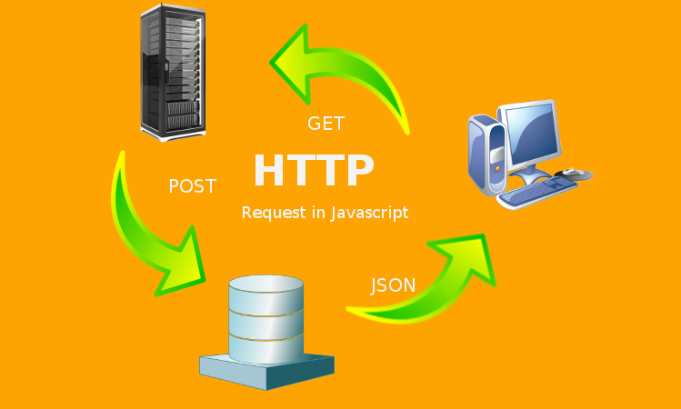

# Teorihandboken - JavaScript (JS)

Studerande Shaker Nasser


## JS 1.1 JavaScript / ECMAScript

Javascript är ett programmeringsspråk som utgavs 1995 och skapades av Brendan Eich och utvecklades tillsammans med många andra utvecklare. Programmeringsspråket utgör funktionalitet till webbsidor och gör dem dynamiska. Javascript tillsammans med HTML och CSS utgör dem tre grundläggande byggstenar i en dymanisk och full funktionuell webbsida. För att enklare kunna förklara javacript så kan man förklara med vad som "händer" på en webbsida när man navigerar, fyller i formulär eller trycker på en knapp. Javascripts vanligaste användningsområden är att det bestämmer vad som händer när användaren intergerar på olika sätt.

För att koden skall köras på ett rätt sätt så ska man definera variabler i dem ordningen som koden skall köras. Detta gör man pga att JavaScript läser koden uppifrån och nedåt.
En variabel är en placeholder för en typ av datatyp/värde. I Javascript finns det följande varibaler:
Automatically

- Using var (äldre webbläsare)
- Using let
- Using const

Dessa datatyper/värden finns i JavaScript:

- String
- Boolean
- Number
- Array
- Object
- Undefined
- Null

Här nedan följer ex på hur koden exkeveras (körs) med hjälp av console.log funktionen.

```js
let x = 1;
console.log(x);
```

Javascript har väldigt många funktioner, en av dem mesta användabara i den nuvarande webbutveckling är API:er. Vi använder API:er i tex väderprogonos webbsidor (Klart.se) eller tex bilupplysningssidor (biluppgifter.se)
Dessa webbsidor hämtar information från en annan källa. Dett kallas för Applikationsprogrammeringsgränssnitt. JavaScript underlättar hämtning av API:er som kan matas ut i HTML format som visas till användaren.

ECMAScript (förkortat ES) är en standard för skriptspråk och används huvudsakligen för att definiera JavaScript. ECMAScript-standarden har utvecklats av organisationen Ecma International och syftar till att standardisera kärnan i JavaScript för att säkerställa att olika webbläsare kan tolka och köra JavaScript på ett enhetligt sätt.

Skillnaden mellan ECMAScript och JavaScript är subtil eftersom JavaScript är en praktiskt genomförande av ECMAScript-standarden. ECMAScript kan ses som den formella specifikationen, medan JavaScript är den mest kända genomförandet av denna specifikation. Termerna används ofta utbytbart, och i praktiken hänvisar de oftast till samma sak, särskilt när det gäller webbutveckling.

Nya versioner av ECMAScript släpps med nya funktioner och förbättringar. Till exempel används termen "ES6" ofta för att referera till ECMAScript 2015, som var en betydande uppdatering med många nya funktioner som arrow functions, template literals och block scope variables.

1. https://www.exsitec.se/blogg/vad-ar-javascript
2. https://www.freecodecamp.org/news/javascript
3. Bok Eloquent JavaScript - Third Edt. - Marijn Haverbeke ISBN: 8006636608372

## JS 1.2 JavaScript-ramverk och -bibliotek

JavaScript-ramverk är förpackningar av färdigskrivna kodbitar som gör det enklare att bygga webbapplikationer. De ger en strukturerad miljö för utvecklare att arbeta inom och följer ofta ett designmönster som heter Model-View-Controller (MVC). MVC delar upp kod i tre delar: modellen hanterar data, vyn visar data för användaren, och kontrollen tar emot användarinput och styr modellen eller vyn. Det här gör det lättare att bygga och underhålla webbapplikationer. Jämfört med kodbibliotek erbjuder ramverk fler verktyg för att skapa applikationer. JavaScript-ramverk är viktiga för att bygga moderna och starka webbapplikationer.

Angular: 
Angular är en open source plattform med Type-Script baserat utvecklingsform. Plattformen är utvecklat av Google och har en väldigt stark support samt dokumenation. Angular använder sig av komponententer för att kunna bygga starka och robust webbapplikationer. Genom att erbjuda en uppsättning utvecklarverktyg för att hjälpa till att utveckla, bygga, testa och uppdatera koden så är angular en väldigt attraktiv plattform bland utvecklare. 

React: 
React är ett open source verktyg på JavaScript som hjälper till att bygga användargränssnitt för webbplatser. Det skapades av Facebook och är perfekt för appar som behöver vara interaktiva och snabba. React är alltså bibliotek och inte ett ramverk, vilket innebär att det är mer flexibelt och kan användas tillsammans med andra verktyg och bibliotek för att skapa den perfekta lösningen för ett projekt. Med React kan man skapa dynamiska och effektiva webbapplikationer genom att använda koncept som virtuell DOM och effektiv hantering av tillstånd. React är ett omtyckt och populärt val bland utvecklare tack vare dess förmåga att effektivt hantera användargränssnitt, modularisera kod och skapa skalbara webbapplikationer.

Backend ramverken så som Express och NextJS:
Express och Next.js är två kraftfulla JavaScript-ramverk för backend-utveckling. Express är minimalistiskt och flexibelt medan Next.js erbjuder server-side rendering och API Routes. Dessa verktyg underlättar skapandet av skalbara och lättunderhållna webbapplikationer.


1. https://generalassemb.ly/blog/what-is-a-javascript-framework/
2. https://medium.com/@evincedevelop/top-10-most-popular-javascript-frameworks-to-choose-in-2024-269453cdaf35
3. https://developer.mozilla.org/en-US/docs/Learn/Tools_and_testing/Client-side_JavaScript_frameworks
4. https://builtin.com/software-engineering-perspectives/react-framework - React förklarad
5. https://www.entire.se/artiklar/javascript-ramverk-en-jamforelse-av-angular-react-och-vue 

## JS 1.3 Promises

Promises standardiserades efter den femte utgåvan av ECMAScript där de asynkrona funktionerna blir alltmer populära. Promises som även kallade "framtida löften" på svenska används för att hantera asynkrona operationer på ett mer strukturerat sätt och erbjuder ett sätt att hantera och samordna flera asynkrona operationer. Med promises kan man koppla ihop asynkrona uppgifter med metoderna async och await, vilket minskar användningen av callback-funktioner. Detta gör koden mer läsbar och lättare att utveckla för framtida projekt.

Promise presenterar värde så som pending (väntande), fullfied (uppfyllt) eller rejected (avvisat). När en promise är "pending", så väntar den på att en asynkron operation ska slutföras. När operationen slutförs, går promisen över till antingen "fulfilled" eller "rejected" beroende på om operationen lyckades eller misslyckades.

1. https://sunlightmedia.org/sv/tips-f%C3%B6r-javascript/
2. https://www.freecodecamp.org/news/javascript-promise-object-explained/

## JS 1.4 OOP i JavaScript

JavaScript är ett OOP-skriptspråk. OOP är fortkortning till Obejktorinterad programmering (Eng: Object Oriented Programming). Programmeringsmetoden gör det möljigt att använda sig av uppsättning av objekt som integerar med varandra och detta skapar effektiv och kraftfulla konstruktion vid stora program.

Objekter är instanser av olika klasser.

För att skapa en objekt börjar man med att deklarera variabeln och sedan namnger man egenskaperna mellan måsvingarna.

```Js

function Person(hometown, hobby, birthday) {
  this.hometown = hometown;
  this.hobby = hobby;
  this.birthday = birthday;
}

// Skapa en instans av Person
var aboutShaker = new Person("Skärholmen, Stockholm", "eating", {month: 4, day: 18, year: 1997});
```

1. https://www.freecodecamp.org/news/how-javascript-implements-oop/
2. https://sv.khanacademy.org/computing/computer-programming/programming/objects/a/review-objects

## JS 1.5 DOM-manipulation

DOM-manipulation är en viktigt verktyg i Javascript där utvecklare kan integerera med HTML element för att skapa en dymanisk och interaktiv plattform. Genom att komma åt element och modifera struktur, styling och innehåll så blir användarupplevelsen mer dynamisk än att bara använda en statisk sida.

För att manilupera DOM trädet så behöver man komma åt elementen genom att använda DOM objekt vilket representerar hela HTML dokumentet. För att komma åt dessa element kan man använda följande exempel:

```Js

// Hämtar ett element efter dess ID
const headerElement = document.getElementById('header');

// Hämtar element efter klassnamn
const paragraphs = document.getElementsByClassName('paragraph');

// Hämtar element efter taggnamn
const images = document.getElementsByTagName('img');
```

När man har lyckats komma åt dessa element så kan man modifera dess innehåll genom att använda detta egenskap:

```Js

// Modifiera innehållet i ett element
headerElement.innerHTML = 'Chas Academy';

// Här nedan så kan vi se exempel på hur man kan modifera stylingen.

// Lägger till en klickhändelselyssnare på knappen
colorButton.addEventListener('click', function() {
// Ändrar färgstilen på stycket
myParagraph.style.color = 'blue';
});

```

1. https://developer.mozilla.org/en-US/docs/Learn/JavaScript/Client-side_web_APIs/Manipulating_documents
2. https://www.freecodecamp.org/news/dom-manipulation-in-javascript/
3. https://www.honeybadger.io/blog/javascript-oop/

## JS 1.6 HTTP-requests

Kommunikationen mellan frontend och backend bygger på HTTP-förfrågningar. Genom detta protokoll kan vi använda funktioner som kräver integration med backend, vilket förenklar hanteringen av data som behöver lagras på en server. För att interagera med en server behöver vi förstå HTTP-protokollet och dess metoder. Vi kan använda HTTP-metoder såsom CRUD (Create, Read, Update, Delete) med hjälp av dedikerade HTTP-verb som POST, GET, PUT/PATCH och DELETE.

När vi kommunicerar med servern skickar den tillbaka ett svar beroende på förfrågans giltighet. Om förfrågan lyckas, skickar servern tillbaka data vanligtvis i JSON-format (ibland XML). Om förfrågan misslyckas, skickar servern tillbaka ett felmeddelande. Felmeddelandet beskrivs oftast med en statuskod, till exempel:

```Bash
”HTTP 401 error – unauthorized”
”401 unauthorized ”
”Access denied”
```

GET. Detta är den mest använda HTTP-förfrågningsmetoden. En GET-förfrågan ber servern om en specifik bit information eller resurs. När du ansluter till en webbplats skickar din webbläsare vanligtvis flera GET-förfrågningar för att få den data den behöver för att sidan ska laddas.

POST. Din webbläsare använder POST-HTTP-förfrågningsmetoden när den behöver skicka data till servern. Till exempel, om du fyller i ett kontaktformulär på en webbplats och skickar det, använder du en POST-förfrågan så att servern tar emot den informationen.

PUT. PUT-förfrågningar är liknande i funktionalitet som POST-metoden. Men istället för att skicka data använder du PUT-förfrågningar för att uppdatera information som redan finns på slutservern.

För att följa dem WCAG riktlinjer så är det völidgt vitkigt at använda enkel och lättförståelig språklig stil i felmeddelanden så att användaren inte känner sig förvirrad eller överväldigad av tekniska termer. Åroblemet ska förkalras på ett sätt som gör det möjligt för användaren att vidta åtgärder för att lösa det.



1. https://kinsta.com/knowledgebase/javascript-http-request/
2. https://www.freecodecamp.org/news/here-is-the-most-popular-ways-to-make-an-http-request-in-javascript-954ce8c95aaa/
3. https://kinsta.com/se/kunskapsbas/401-felet/
4. https://kinsta.com/knowledgebase/what-is-an-http-request/

## JS 1.7 Lexical scope

Lexical scope är ett fundamentalt koncept inom programmering, framför allt inom JavaScript-programmering. Lexical scope avgör tillgängligheten för variabler som deklareras i den fullständiga källkoden. När en variabel deklareras i en global scope är den tillgänglig över hela JavaScript-koden. Nackdelen med en global scope är att den kan leda till svårigheter med felsökning och testning, eftersom variabler lätt kan skrivas över av misstag eller påverka andra delar av programmet oavsiktligt. Lexical scope löser detta genom att tillåta variabler att endast vara tillgängliga inom den funktion där de är deklarerade eller i de inre funktionerna, vilket skapar en tydligare struktur och minskar risken för oväntade bieffekter.

Däremot finns det lokala scop som deklareras inuti en funktion och är endast tillgängliga inuti den funktionen. Dessa variabler är vanligtvis att föredra eftersom de minskar risken för namnkonflikter och håller variabler begränsade till de delar av koden där de verkligen behövs.

```js
function outerFunction() {
  var outerVar = "I'm in outer-scope";

  function innerFunction() {
    var innerVar = "I'm in inner-scope";
    console.log(outerVar); // Vi kan komma åt outerVar här eftersom den är i det omfånget där innerFunction() definieras.
  }

  innerFunction();
  console.log(innerVar); // Detta skulle orsaka en fel, eftersom innerVar bara är definierad i det omfånget av innerFunction().
}

outerFunction();
```

En förändring som kom med ECMAScript 2015 (ES6) var möjligheten att använda `let` och `const` för att skapa block scope. Detta innebär att variabler som deklareras med `let` eller `const` är endast tillgängliga inom det block där de är deklarerade. Till exempel, om vi deklarerar variabler inuti ett `if`-block eller en loop med `let` eller `const`, kommer de endast vara tillgängliga inuti det specifika blocket och inte utanför det. Detta ger utvecklare bättre kontroll över variabler och minimerar risken för oönskade sido effekter. Block scope med `let` och `const` bidrar till att förbättra kodens läsbarhet och underhållbarhet genom att tydligt definiera var variabler är tillgängliga och när de går ut ur omfånget. Detta är särskilt användbart i komplexa kodbaser där olika delar av koden kan ha olika krav på variabler.

1. https://cleverzone.medium.com/lexical-scope-in-javascript-929789101dab
2. https://www.freecodecamp.org/news/javascript-lexical-scope-tutorial/
3. https://www.freecodecamp.org/news/write-less-do-more-with-javascript-es6-5fd4a8e50ee2/

## JS 1.8 Event handling

Event referar till en handling där användaren interagerar med sidan och förväntar sig en dynamisk upplevelsen. En användaren vill till exempel kunna integerara genom att klicka på element så som knappar eller inmatningsfältar. Detta handling notiferar till webbläsaren att användaren har försökt komma åt en handling och behöver få respons. Detta sker genom en verktygsfunktion som kallas för event handler som lystnar på en särskild typ av begärd event.

Det finns massor av olika händelser som kan hanteras i JavaScript, som när en användare integerar applikationen med klicka med musen, trycker på en tangent, rör musen, fyller i ett formulärfält, laddar en sida, och mycket mer. Genom att lyssna och hantera dessa händelser kan webbsidor bli interaktiva och reagera på det användaren integerar med görs på ett smidigt sätt.

När eventhanteraren körs, kan den också få reda på information om själva händelsen, som vilket element användaren klickade på, vilken knapp användaren tryckte ner eller vilken tangent användaren tryckte på. Den här informationen kan vara användbar för att göra olika saker beroende på vad som hände och när det hände.

Eventhantering är viktigt för webbutveckling eftersom det gör det möjligt att skapa användarvänliga gränssnitt och ge användarna en bra upplevelse när de använder webbapplikationer.

Det finns olika typ av events där den mest användbara är 'onlick'.

```js
// Hämta referens till knappen
var minKnapp = document.getElementById("minKnapp");

// Lägg till en eventhanterare för klickhändelser på knappen
minKnapp.addEventListener("click", function() {
    // Kod som ska köras när knappen klickas på
    alert("Knappen klickades på!");
});

```
Event handling i ramverket Angular (ex tagen från Recipe-APP): 

<button [disabled]="!loginObj.email || !loginObj.password" type="submit" (click) ="onLogin()">Sign in</button>

Mouseover och Mouseout events är användbara för hover-effekter på webbsidor, där något aktiveras när muspekaren går över eller lämnar ett element. Det kan vara att ändra färg på en knapp eller visa mer information när musen sveper över en bild.

Keydown, Keypress och Keyup events fångar tangenttryckningar från användaren, vilket är avgörande för att hantera användarinmatning på webbsidor. De är särskilt användbara för att skapa interaktiva formulär eller möjliggöra tangentbordsnavigering.

Att förstå sig på eventhandling kommer även att underlätta hur man testar sin applikation och använder sig av benchmarking verktyg så som DevTools. Detta kommer hjälpa en att inspektera i konsolen och leta efter sårbarheter i koden och förminska spillotiden.

1. https://dev.to/shubhankarval/event-handling-in-javascript-51n3
2. https://www.scaler.com/topics/javascript/event-handling-in-javascript/
3. https://medium.com/@theriyasharma24/event-handling-in-angular-a5854a61b4a5
4. https://medium.com/@ratnesh4209211786/mastering-event-handling-in-javascript-a-comprehensive-guide-51204c2cf552

## JS 1.9 Prototype inheritance

Beskriv rubriken här

1. https://www.freecodecamp.org/news/prototypes-and-inheritance-in-javascript/
2. https://medium.com/@kevincennis/prototypal-inheritance-781bccc97edb
3. https://medium.com/@amitbadala/understanding-and-implementing-prototype-inheritance-in-javascript-fef72c2341fa
4. https://reference.codeproject.com/javascript/inheritance_and_the_prototype_chain

## JS 1.10 Higher-order functions

I JavaScript är 'higher-order functions' (högre ordningens funktioner) funktioner som antingen tar andra funktioner som argument eller returnerar en funktion som resultat, eller både och. En funktion i sig är en serie instruktioner för att utföra en viss typ av operation, och dessa funktioner använder parametrar för att definiera de värden som ska behandlas när koden körs. Dessa funktioner är kraftfulla eftersom det går att återanvända dem i koden. 

För att kunna förstå sig på högre higher-order functions så är det bättre att bryta ner dem och förstå de mindre delarna innan man närmar sig konceptet som helhet. 

I detta exempel nedan så är `greet` namnet av funktionen och `name` är det parametern som skickas in i funktionen.  

En defintion av en enkel JavaScript function:

```js
function greet(name) {
  console.log("Hello, " + name + "!");
}
```

Callbackfunktioner är som instruktioner som man ger till någon annan att använda vid behov. När den andra personen är klar med sin uppgift, följer de  instruktioner och gör det som har ombetts att gör.

I det här enkla exemplet:

```javascript
function promptInput(callbackFn) {
  const name = prompt('Vad är ditt namn?');
  callbackFn(name);
}

promptInput(name => console.log(`Hej ${name}!`));
```

Funktionen `promptInput` ber användaren att ange sitt namn. När användaren gör det, anropar den den medföljande instruktionen (callbackfunktionen) för att säga hej med det namn som angavs.

Callbackfunktioner är användbara när man behöver att något ska hända efter en viss händelse eller efter en uppgift är klar, som att hämta data från en databas eller när man vill reagera på en knapptryckning på en webbsida.

Här nedan följs ett enklare exempel på Higher-order funktion: 

```js
function sayHello() {
  console.log("Hej!");
}

function sayGoodbye() {
  console.log("Hejdå!");
}

function greet(saySomething) {
  saySomething(); // Här används higher-order funktionen 
}

greet(sayHello);    // Output: Hej!
greet(sayGoodbye);  // Output: Hejdå!
```
I greet-funktionen tar den parameter saySomething, vilket förväntas vara en annan funktion. Sedan använder den denna funktion genom att helt enkelt kalla den, vilket innebär att den andra funktionen utförs när greet kallas.

I de två anropen till greet, skickar vi sayHello respektive sayGoodbye som argument. Så när vi kallar greet(sayHello), kör den sayHello-funktionen och skriver ut "Hej!" på konsolen. När vi kallar greet(sayGoodbye), kör den sayGoodbye-funktionen och skriver ut "Hejdå!".

1. https://www.reddit.com/r/learnjavascript/comments/r1z131/can_someone_help_explain_what_a_higherorder/ 
(Tog reddit för just denna förklarar väldigt bra)
2. https://medium.com/@rabailzaheer/first-class-and-higher-order-functions-86d14e40c688
3. https://www.telerik.com/blogs/master-higher-order-functions-javascript (Förklarar alla slags (användbara) funktioner också)
4. https://www.almabetter.com/bytes/tutorials/javascript/higher-order-functions


## JS 1.11 Single-thread programming

Beskriv rubriken här

asynkrona metoder


1. https://medium.com/swlh/what-does-it-mean-by-javascript-is-single-threaded-language-f4130645d8a9
2. https://dev.to/bbarbour/if-javascript-is-single-threaded-how-is-it-asynchronous-56gd
3. https://elijahtrillionz.com/why-is-javascript-single-threaded-and-non-blocking


## JS 1.12 OAuth från frontend

v 21

## JS 1.13 Websockets

v 20
