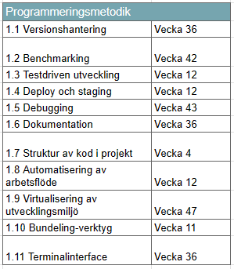
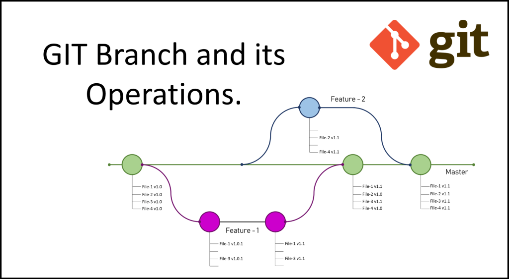

# Teorihandboken - Programmeringsmetodik (PG)
Studerande: Shaker Nasser

## PG 1.1 Versionshantering (Git)
GIT är ett kraftfullt verktyg för versionshantering som används av utvecklare för att effektivt spåra och hantera ändringar i källkoden under projektutveckling. Det ger en strukturerad och samarbetsvänlig metod för att spåra historiken över projektet och underlättar samtidigt arbete från flera utvecklare. Nedan presenteras en översikt över viktiga koncept inom GIT-versionshantering.

GIT möjliggör hantering av kodversioner över tid. Det skapar en tidslinje av ändringar, vilket gör det möjligt att återställa eller jämföra olika versioner av koden. Det är särskilt användbart när flera personer arbetar på samma projekt samtidigt.

I GIT kallas den centrala lagringen för källkoden för ett "repository". Det finns två typer av repositories: lokala och fjärr. Lokala repositories lagras på utvecklarens dator, medan fjärrrepositories används för samarbete mellan flera utvecklare.

GIT möjliggör utveckling på olika "grenar" samtidigt. En gren är en oberoende linje av utveckling där ändringar kan göras utan att påverka huvudkoden. Merging används för att kombinera ändringar från en gren till en annan.
Ibland uppstår konflikter när två grenar ändrar samma rad i koden. GIT erbjuder verktyg för att manuellt lösa konflikter innan de fusioneras, vilket säkerställer att koden förblir korrekt.

Fjärrrepositoryn, som finns på tjänster som GitHub eller GitLab, möjliggör samarbete mellan utvecklare. Genom "pull requests" kan utvecklare föreslå ändringar och begära att de fusioneras till huvudgrenen.

GIT tillåter användning av .gitignore-filer för att ange vilka filer eller mappar som ska ignoreras och inte spåras av versionshanteringen. Det är användbart för att undvika att känslig information och onödiga filer läggs till i repositoryt.

Genom att använda kommandot git log kan utvecklare granska historiken över tidigare commits. Det ger en detaljerad översikt över vem som gjorde vilka ändringar och när.

"Git Flow" är en populär metodik för att organisera arbetsflödet med GIT. Den inkluderar användningen av specifika grenar för funktioner, utveckling och utgåvor för att strukturera utvecklingsprocessen på ett organiserat sätt.

GIT har blivit det föredragna verktyget för versionshantering inom öppen källkodsprojekt och används av miljontals utvecklare över hela världen.

## PG 1.2 Benchmarking

Inom webbutveckling är benchmark ett vanligt begrepp som används för att mäta och jämföra prestanda eller effektivitet hos olika webbplatser eller webbapplikationer. Det kan inkludera hastighetstester, laddningstider och andra metriker för att utvärdera hur väl en webbplats eller en specifik funktion presterar i jämförelse med branschstandarder eller konkurrenter. Att använda benchmarking i utvecklingsprocessen hjälper till att identifiera områden för förbättring och säkerställa en bättre användarupplevelse.

Lighthouse är en av dem verkygen som Goolge har utvecklat för att testa webbsidor när det gäller prestanda, tillgänglighet, bästa praxis och SEO. Det ger en övergripande bild av hur bra en webbplats presterar och ger förslag på förbättringar. Lighthouse kan betraktas som ett benchmarkverktyg eftersom det ger objektiva mätningar och riktlinjer för att jämföra en webbplats prestanda med etablerade standarder.

Goolge DevTools är en uppsättning av webbutvecklingsverktyg som ingår i de flesta webbläsare. Inom DevTools kan man använda olika flikar såsom Audits. För att utföra prestandamätningar och få förslag på förbättringar. Detta gör det möjligt för utvecklare att identifiera och lösa problem som kan påverka prestandan. Goolge DevTools ger även möjlighet att följa dem vanliga HTML och CSS fel innan koden kan implenteras. Detta är en utmärkt verktyg för nybörjare inom webbutveckling. 

1. 
2. 

## PG 1.3 Testdriven utveckling
Beskriv rubriken här

## PG 1.4 Deploy och staging
Beskriv rubriken här

## PG 1.5 Debugging
Beskriv rubriken här

## PG 1.6 Dokumentation
Beskriv rubriken här

## PG 1.7 Struktur av kod i projekt
Beskriv rubriken här

## PG 1.8 Automatisering av arbetsflöde
Beskriv rubriken här

## PG 1.9 Virtualisering av utvecklingsmiljö
Beskriv rubriken här

## PG 1.10 Bundeling-verktyg
Beskriv rubriken här

## PG 1.11 Terminalinterface

Terminalgränssnittet och Git Bash är verktyg för att interagera med datorns operativsystem genom kommandoraden. De möjliggör för användare att utföra kommandon och genomföra olika uppgifter utan att använda en grafisk användargränssnitt.

Ett terminalgränssnitt är en textbaserad miljö där användaren interagerar med datorn genom att skriva kommandon i en kommandorad eller terminal. I Unix-baserade system, såsom Linux och macOS, används ofta Terminal-appen. I Windows används kommandotolken (Command Prompt) eller PowerShell som exempel på terminalgränssnitt.

Git Bash är en terminalapplikation som ingår i Git-paketet. Den erbjuder en kommandoradsmiljö för användning med Git och andra Unix-verktyg direkt på Windows-systemet. Git Bash ger användare tillgång till Git-kommandon och Unix-liknande kommandon i en bekväm miljö på Windows-plattformen. Resultatet av kommandon och operationer visas vanligtvis som text direkt i terminalfönstret, vilket ger användaren tydlig feedback.

Terminalgränssnitt är vanligtvis beroende av operativsystemet. Till exempel används Terminal-appen i Linux eller macOS, medan Git Bash är specifikt utformad för Windows.Terminalgränssnitt kan vara allmänt och används för att utföra olika systemrelaterade uppgifter. Git Bash är mer specialiserad och fokuserar på Git-kommandon och verktyg.

Båda dessa verktyg är kraftfulla och ger avancerad kontroll och flexibilitet för användare som föredrar att använda kommandoraden för att hantera sina system och Git-repositorier.

