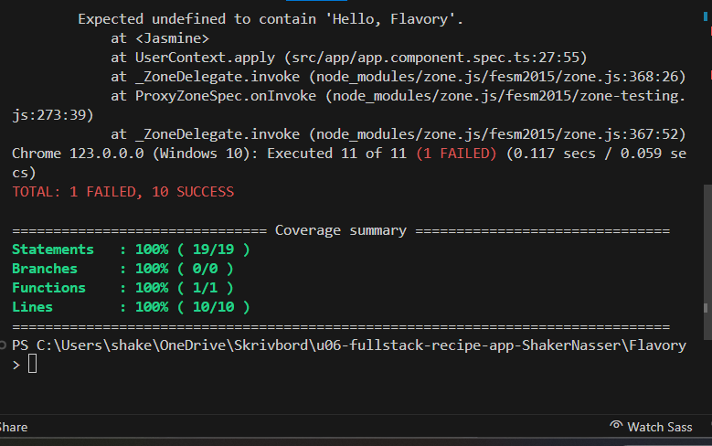
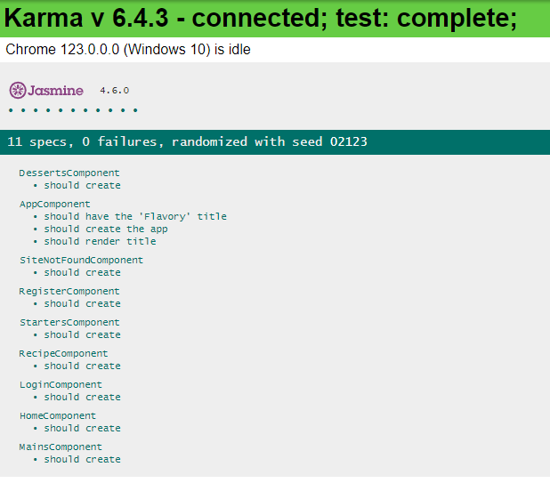
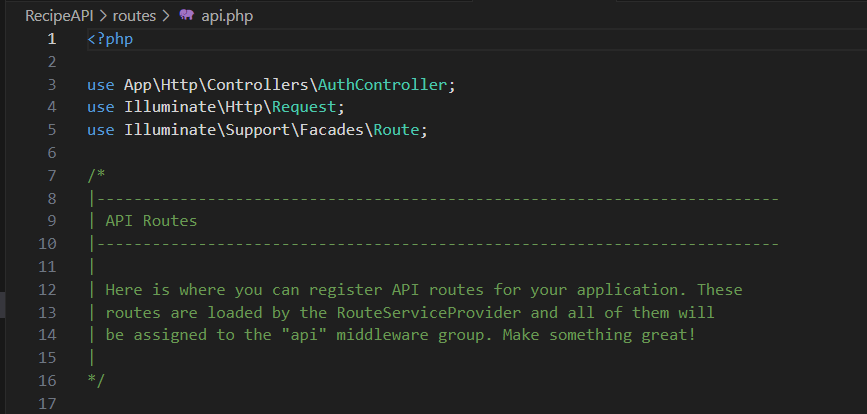

# Teorihandboken - Programmeringsmetodik (PG)
Studerande: Shaker Nasser

## PG 1.1 Versionshantering (Git)

GIT är ett kraftfullt verktyg för versionshantering som används av utvecklare för att effektivt spåra och hantera ändringar i källkoden under projektutveckling. Det ger en strukturerad och samarbetsvänlig metod för att spåra historiken över projektet och underlättar samtidigt arbete från flera utvecklare. Nedan presenteras en översikt över viktiga koncept inom GIT-versionshantering.

GIT möjliggör hantering av kodversioner över tid. Det skapar en tidslinje av ändringar, vilket gör det möjligt att återställa eller jämföra olika versioner av koden. Det är särskilt användbart när flera personer arbetar på samma projekt samtidigt.

I GIT kallas den centrala lagringen för källkoden för ett "repository". Det finns två typer av repositories: lokala och fjärr(remote). Lokala repositories lagras på utvecklarens dator, medan fjärrrepositories används för samarbete mellan flera utvecklare (Grupparbeten som u02 och u05).

GIT möjliggör utveckling på olika "grenar" samtidigt. En gren är en oberoende linje av utveckling där ändringar kan göras utan att påverka huvudkoden. Merging används för att kombinera ändringar från en gren till en annan.
Ibland uppstår konflikter när två grenar ändrar samma rad i koden. GIT erbjuder verktyg för att manuellt lösa konflikter innan de fusioneras, vilket säkerställer att koden förblir korrekt.

GIT tillåter användning av .gitignore-filer för att ange vilka filer eller mappar som ska ignoreras och inte spåras av versionshanteringen. Det är användbart för att undvika att känslig information och onödiga filer läggs till i repositoryt.

"Git Flow" är en populär metodik för att organisera arbetsflödet med GIT. Den inkluderar användningen av specifika grenar för funktioner, utveckling och utgåvor för att strukturera utvecklingsprocessen på ett organiserat sätt.

Git har blivit det föredragna verktyget för versionshantering inom öppen källkodsprojekt och används av miljontals utvecklare över hela världen.


Här nedan följer ett par grundläggande git kommandon:

För att klona ner ett bifentligt repo (med git init mapp i):

```bash
git clone <repo-url>

```

Lägg till alla ändringar för att staging-området:

```bash
git add .

```

Skicka in stageade ändringar:

```bash
git push

```

Den mest användbara kommandon (enligt mig):

```bash
git status

//

git log

```

1. https://product.hubspot.com/blog/git-and-github-tutorial-for-beginners
2. https://www.atlassian.com/git/tutorials/what-is-git
3. https://www.freecodecamp.org/news/what-is-git-and-how-to-use-it-c341b049ae61/
4. https://www.freecodecamp.org/news/10-important-git-commands-that-every-developer-should-know/

## PG 1.2 Benchmarking

Inom webbutveckling är benchmark ett vanligt begrepp som används för att mäta och jämföra prestanda eller effektivitet hos olika webbplatser eller webbapplikationer. Det kan inkludera hastighetstester, laddningstider och andra metriker för att utvärdera hur väl en webbplats eller en specifik funktion presterar i jämförelse med branschstandarder eller konkurrenter. Att använda benchmarking i utvecklingsprocessen hjälper till att identifiera områden för förbättring och säkerställa en bättre användarupplevelse.

Lighthouse är en av dem verkygen som Goolge har utvecklat för att testa webbsidor när det gäller prestanda, tillgänglighet, bästa praxis och SEO. Det ger en övergripande bild av hur bra en webbplats presterar och ger förslag på förbättringar. Lighthouse kan betraktas som ett benchmarkverktyg eftersom det ger objektiva mätningar och riktlinjer för att jämföra en webbplats prestanda med etablerade standarder.

Goolge DevTools är en uppsättning av webbutvecklingsverktyg som ingår i de flesta webbläsare. Inom DevTools kan man använda olika flikar såsom Audits. För att utföra prestandamätningar och få förslag på förbättringar. Detta gör det möjligt för utvecklare att identifiera och lösa problem som kan påverka prestandan. Goolge DevTools ger även möjlighet att följa dem vanliga HTML och CSS fel innan koden kan implenteras. Detta är en utmärkt verktyg för nybörjare inom webbutveckling.

DevTools gör det möjligt att effektivt debugga (felsöka) webbplatser i realtid. Ett praktiskt exempel på detta var i vårt IMDB-clone-projekt där vår grupp (grupp5) stötte på problem med att bilder och CSS-filer inte tillämpades korrekt i webbläsaren. Genom att använda DevTools kunde vi noggrant följa upp felkoden och identifiera varför vissa stilar och resurser inte visas som förväntat. Med den realtids information kunde vi sedan snabbt vidta åtgärder för att lösa problemen och säkerställa att vår webbplats fungerade korrekt för användarna.


1. https://developer.chrome.com/docs/lighthouse/overview/
2. https://developer.chrome.com/docs/devtools/open/
3. https://nira.com/chrome-developer-tools/
4. https://www.freecodecamp.org/news/chrome-devtools/

## PG 1.3 Testdriven utveckling

Test Driven Development (TDD) är en utvecklingsmetod där man först skriver tester för den funktionalitet som ska implementeras. Målet är att låta dessa tester misslyckas för att identifiera potentiella risker i koden. Sedan skrivs själva koden på ett enkelt sätt för att uppnå att testerna går igenom. Detta möjliggör enklare refaktorisering och utveckling av koden. En viktig princip är att koden bör vara uppdelad i små, isolerade komponenter med funktionaliteten uppdelad i flera olika metoder. Denna uppdelning underlättar förståelsen och underhållet av koden samt möjliggör en mer strukturerad och robust utvecklingsprocess.

Det finns olika typer av testning som delas upp i manuella, automatiserade och kontinuerliga.
För webbutveckling är enhetstester och end-to-end-tester de mest relevanta.
Enhetstester handlar om att testa enskilda metoder och funktioner i klassen, komponenter eller användas av programvaran. Det innebär att man isolerar delarna av applikationen och testar dem separat från allt annat.
End-to-end-tester innebär att man replikerar användarbeteendet i mjukvaran i en komplett applikationsmiljö genom att visualisera hur användaren skulle interagera för att utvärdera resultatet.

I Angular använder vi Jasmine-ramverket för att konfigurera våra tester och Karma för att köra dem. Jasmine används för att skriva våra testfall och definiera deras beteende, medan Karma hanterar exekveringen av testerna i olika webbläsare och miljöer.

Mappar som slutar med ".spec.ts" genereras automatiskt för oss när vi skapar nya filer för både services och komponenter. Dessa specifikationsfiler innehåller våra testfall och definierar hur våra komponenter och tjänster bör fungera.

För att köra våra tester måste vi vara i rätt katalog i projektets rotmapp och sedan köra följande kommando i terminalen:

```bash

npm run test

```

Detta kommando triggar Karma och kör alla testfiler som slutar med ".spec.ts" i den aktuella katalogen och dess undermappar. Resultaten från testkörningen visas sedan i browser och i terminalen och eventuella fel eller misslyckanden rapporteras där.

```bash
ng test --no-watch --code-coverage

```

Detta kommando används för att köra Angular-testerna en gång utan att lyssna på filändringar och generera en rapport om kodtäckning.

Outpt i terminalen: 



Outpt i Google brwoser: 



1. https://dev.to/qarunqb/tdd-in-angular-understanding-an-angular-unit-test-jja
2. https://www.youtube.com/watch?v=uefGmRcIm3c&pp=ygULYW5ndWxhciB0ZGQ%3D
3. https://testdriven.io/test-driven-development/
https://medium.com/@dees3g/a-guide-to-test-driven-development-tdd-with-real-world-examples-d92f7c801607
4. Lektion 2024-03-21 

## PG 1.4 Deploy och staging

När man pratar om deploy och staging inom webbutveckling så innebär det att man tar webbapplikationen från utvecklingsmiljön och sedan placerar den på en server där den kan vara tillgänglig för en användare. Enklare sagt detta är som att flytta applikationen från en laboratorie till en butik, där den kan vara tillgängkug för kunderna (användare).

För att uppnå detta så måste man gå genom dessa faser:

Utvecklingsfasen, här arbetar man med att utveckla och förbättra. Tex när vi i grupparbetet (U05) fick i uppgift att skapa en IMDB clone och detta gjordes lokalt på en dator men sedan på en utvecklingsmiljö på en server.

Commit och push till git, här commitade och pushade vi dem koderna vi ansåg vara klara till det gemensamma git-repot. Vi använde oss av GitHub-flow när vi versionhanterade.


CI/CD pipeline övervakade vårt Git-repo och initierade automatiskt när vi pushade kod till main. Inom denna pipeline körs olika tester för att säkerställa att vår kod fungerar korrekt. Om några tester misslyckas, får vi varningar om fel som måste åtgärdas innan fortsatt utrullning. (Denna stadie gick inte bra för oss i grupp).

Stagingmiljön, om alla tester lyckas deployas vår kod till en "stagingmiljö". Detta är en miljö som liknar produktionsmiljön, vi i team kunde noggrant testa applikationen innan den släpps till allmänheten.

Deploy till produktionsmiljön, när vi var nöjda med testningen och allt fungerar som det ska i stagingmiljön, deployade vi koderna till den faktiska produktionsmiljön. Här var vår IMDB Clone-upplaga tillgänglig för användare på internet.


I vårt imdb Clone projekt använde vi oss av Vercel för att (mest) deploya fronend koderna och Aiven för att hantera databasinfrastruktur.

1. https://www.techtarget.com/searchsoftwarequality/definition/staging-environment
2. https://umbraco.com/knowledge-base/staging-environment/
3. https://dev.to/flippedcoding/difference-between-development-stage-and-production-d0p

## PG 1.5 Debugging

Felsökning är en avgörande process inom programmering och systemutveckling som syftar till att upptäcka och rätta fel i koden. Det innefattar två huvudtyper av fel: syntaxfel och logiska fel. Syntaxfel är felaktigheter i koden som bryter mot språkets regler och vanligtvis leder till tydliga felmeddelanden från utvecklingsmiljön eller kompilatorn. Logiska fel svårare att upptäcka eftersom de inte nödvändigtvis genererar felmeddelanden, utan snarare kan leda till felaktigt beteende eller resultat när programmet körs.


För att åtgärda dessa fel och säkerställa att programmet fungerar korrekt används felsökningsmetoder. En vanlig metod är att använda brytpunkter, där programmeraren markerar specifika platser i koden där programmet ska pausa så att utvecklaren kan inspektera dess tillstånd och variabler. Genom att stegvis gå igenom koden kan man identifiera var felet uppstår och korrigera det. Andra metoder inkluderar användning av loggfiler för att spåra programflödet och användning av olika verktyg för att analysera minnesanvändning och prestanda.


ESLint är ett verktyg för statisk kodanalys inom JavaScript-utveckling. Dess syfte är att upptäcka problem i JavaScript-koden genom fördefinierade regler och konfigurationer. Det bidrar till att upprätthålla kvalitet och enhetlighet genom att markera potentiella fel, stilbrott och andra problem i koden.

Ett annat användbar verktyg som används är prettier. Det används för att formatera kod automatiskt enligt förutbestämda regler och konventioner. Det är särskilt populärt inom webbutveckling.

Fun fact:
Det finns flera bolag där programmerare inom mnjukvaruutveckling använder sig av gummiandsteorin. Detta innebär att en programmerare förklarar sin kod för en gummiand (kan vara annat föremål) för att lösa problem eller förstå sin kod enklare.En höglösning för en programmerare kan vara en väldigt bra metodik.
Denna teknik är ganska populär och effektiv där reslutat har visat sig positivt.

1. https://aws.amazon.com/what-is/debugging/
2. https://www.ibm.com/topics/debugging
3. https://www.freecodecamp.org/news/rubber-duck-debugging/
4. https://www.jondjones.com/architecture/frameworks/visual-studio-code/learn-to-use-the-javascript-debugger-in-visual-studio-code/

## PG 1.6 Dokumentation

Dokumenatation inom webbutveckling är en viktig del inom utvecklingsprocessen. Detta innebär att skriva och organisera information om en webbapplikation eller ett webbprojekt. Dokumentets syfte är att ge en översikt, förklaring och instruktioner om aspekterna av projeket för att underlätta för utvecklare, användare och andra intressenter. Det mest förekommande typ av dokumentation är att man skriver kodkommentarer inuti själva koden. Detta är en förekommande dokumentation där utvecklare hjälper till att förstå och få utrymme för att utveckla koden.

Det finns flera delar av dokumentation som fyller olika syften, här nedan nämns dem två vanligaste:

Användardokumentation:
Denna typ av dokumentation är avsedd för slutanvändare av webbapplikationen. Den innehåller vanligtvis användarinstruktioner, handledningar, FAQ och andra resurser som hjälper användare att förstå hur man använder applikationen, utför olika uppgifter och löser vanliga problem. Användardokumentationen fokuserar på att göra användarupplevelsen så smidig och intuitiv som möjligt.

Interndokumentation:
Interndokumentation är riktad till det interna utvecklingsteamet eller andra personer som är involverade i projektet. Detta kan inkludera tekniska specifikationer, interna processdokument, kodstandarder, utvecklingsriktlinjer och andra resurser som hjälper till att underlätta samarbete, förståelse och effektivitet inom teamet. Interndokumentationen är avgörande för att säkerställa att alla i teamet har en gemensam förståelse för projektet och arbetar i enlighet med bästa praxis och riktlinjer.
<br>
Exempel 1 på interndok i kod.

<br>
Exempel 2 på interndok i kod.



I större projekt är kvaliteten på internadokumentationen en avgörande faktor för projektets framgång. Genom en utförlig dokumentation kan flera utvecklare arbeta mot samma mål och hålla sig uppdaterade. I vårt IMDB-clone-projekt använde vi internadokumentation både i mapproten och i externa filer i form av en Google Drive-mapp. Denna form av dokumentation bidrog till att vi höll oss uppdaterade och minimerade tidsspillet på att leta efter svar från varandra. Användardokumentationen skapades i form av en README.md-fil där förklaringar ges om hur användaren kan använda och navigera genom sidan.


Utöver dessa typer av dokumentation kan man också inkludera testdokumentation och underhållsdokumentation. Dessa typer blir särskilt relevanta i större projekt och inom större bolag. Det är viktigt att ha kännedom om dem och att inkludera dem i projektets dokumentationsstrategi.

1. https://www.kodamera.se/artiklar/hur-man-skriver-bra-dokumentation
2. https://makemeaprogrammer.com/should-developers-write-documentation-yes-and-heres-why/
3. https://document360.com/blog/user-documentation/
4. https://www.nuclino.com/solutions/internal-documentation

## PG 1.7 Struktur av kod i projekt

En organiserad struktur av kod i ett projekt gör att utvecklare lättare att förstå, underhålla och utveckla projektet. Detta gör att man kan förbättra skalbarheten, flexibiliteten och återanvändbarheten i koden (projektet). Dem olika mapparna seperars där olika ansvarsområden är tyldiga. uppdelad i olika filer och mappar enligt en logisk struktur, med tydliga separeringar av olika delar av applikationen, såsom frontend, backend, databasåtkomst, konfiguration, resurser och så vidare.
Detta förenklar även arbete i grupp där flera utvecklare integerar med samma mappar.

- App: I vår mapp app har vi all affärslogik och hantering av IMDb-relaterade funktioner. Det inkluderar våra modeller för filmer, skådespelare, recensioner och andra relaterade objekt. Vi har även våra kontrollers här som hanterar begäranden och svarar med data från våra modeller.

- Config: Alla våra konfigurationsfiler för vår IMDb clone finns här. Det kan inkludera inställningar för databasanslutningar, sessionshantering, användarautentisering och andra konfigurationer som är specifika för vårt projekt.

- Database: I vår mapp database har vi våra migrationsfiler för att skapa och hantera vårt databasschema för IMDb-relaterade entiteter såsom filmer, skådespelare och recensioner. Vi kan också ha seeders här för att fylla vår databas med testdata.

- Public: Alla våra offentligt tillgängliga filer såsom CSS och bilder ligger här. Detta inkluderar även vår ingångspunktsfil index.php, som är den första filen som webbläsaren laddar när en användare besöker vår webbplats.

- Routes: Alla våra ruttkonfigurationer finns här. Det inkluderar definitioner för webbrutter (t.ex. web.php) för att hantera webbplatssidor

- Storage: Här lagrar vi våra genererade filer, t.ex. cachefiler, sessionsdata och uppladdade filer såsom filmaffischer. Denna mapp bör vara skrivskyddad från webbservern för att säkerställa säkerhet och integritet för våra data.

- Vendor: Här ligger våra Laravel-installerade beroenden och eventuella tredjepartsbibliotek som vi har installerat via Composer. Det inkluderar själva Laravel-ramverket.

I detta grupp projekt använde oss MVC designmönster, följ länken nedan:

[BE 1.4 MVC](Backendutveckling.md#be-14-mvc)

1. https://mitcommlab.mit.edu/broad/commkit/file-structure/
2. https://medium.com/@deshayk/programming-101-file-structures-2e4699ac0fc2
3. https://dev.to/sathishskdev/part-2-folder-structure-building-a-solid-foundation-omh

## PG 1.8 Automatisering av arbetsflöde

Beskriv rubriken här

## PG 1.9 Virtualisering av utvecklingsmiljö

Virtualisering av utvecklingsmiljö innebär att skapa och använda virtuella versioner av hårdvaruenheter och/eller operativsystem för att simulera en komplett utvecklingsmiljö. Detta ger flera fördelar för utvecklare och organisationer.

Virtuella miljöer är separerade från varandra, vilket innebär att eventuella ändringar eller problem i en virtuell miljö inte påverkar andra miljöer. Detta är särskilt användbart när man arbetar med flera projekt som kan ha olika beroenden eller krav.

Utvecklare kan skapa exakta kopior av en utvecklingsmiljö och distribuera dem över olika system. Detta underlättar samarbete, testning och ser till att varje utvecklare arbetar i en konsekvent miljö. Virtualisering gör det möjligt att snabbt konfigurera och anpassa utvecklingsmiljöer. Utvecklare kan enkelt växla mellan olika verktyg, bibliotek och versioner av programvara utan att påverka andra delar av systemet.

Genom att använda virtuella maskiner kan utvecklare undvika kostnaderna för att skaffa och underhålla fysisk hårdvara. Dessutom minimeras risken för konflikter mellan olika programvaror och tjänster. Virtualisering gör att programvaran enkelt och snabbt testas i olika miljöer och konfigurationer, vilket är viktigt för att säkerställa att applikationen fungerar korrekt i olika scenarier.

Det finns olika sätt att implementera virtualisering av utvecklingsmiljöer, inklusive användning av virtualiseringsprogram, containerteknik (som Docker) och molnbaserade utvecklingsmiljöer. Valet beror på specifika behov och krav för projektet och organisationen.

Docker-container:
En körbar mjukvarupaket som innehåller allt som behövs för att köras, och som finns i en isolerad miljö (som ett eget operativsystem).

- Kan byggas och köras oberoende av plattform
- Isolerar mjukvaran från sin omgivning
- Gör det enklare att testa på ett annat sätt
- Om något går fel, påverkar det bara behållaren och inte ens eget operativsystem
- Minskar konflikter som kan uppstå i teamet
- Olika lokala inställningar står inte i konflikt med varandra

1. https://barrazacarlos.com/sv/fordelar-och-nackdelar-med-virtualisering/
2. https://www.dustin.se/solutions/kunskapsbanken/archive/docker-ett-trovaerdigt-alternativ-i-datahallen
3. https://docker-curriculum.com/
4. https://www.ibm.com/topics/docker

## PG 1.10 Bundeling-verktyg

Bundling-verktyg används i större projekt för att kombinera flera separata filer med källkod (till exempel HTML, CSS, Javascript) till färre. Koden levereras mer hanterbar till webbläsaren och koden läses av på ett korrekt sätt. Dessa verktyg är väldigt användbara och avgörande för en utvecklingsprocess. Dessa verktyg effektiviserar utvecklingsprocessen och optimerar prestandan på webbplatser genom att minimera filstorlekar och HTTP-requesten.

De mest populära bundlingverktygen inom webbutveckling är Webpack och Parcel. Webpack erbjuder också en mängd olika plugins och loaders som kan utöka dess funktionalitet och möjliggöra en rad olika användningsområden. Till exempel kan loaders användas för att konvertera filer från ett format till ett annat (till exempel att konvertera SCSS till vanlig CSS eller TypeScript till vanlig JavaScript), medan plugins kan användas för att utföra uppgifter som minifiering, filoptimering och cache.

I vårt IMDB-clone-projekt, innan vi bestämde oss att använda Tailwind som styling CSS-ramverk så använde vi oss av SCSS som krävde bundlingverktyg för att kompilera till CSS.
Detta genom att inkludera följande:

Mapp -> resources/sass/app.scss kompileras till -> public/css

```bash
mix.sass('resources/sass/app.scss', 'public/css');
```

I Angular används Angular CLI för att skapa och hantera projekt, med detta så kommer även ett inbyggt supportsystem där Webpack är en bundler. Automatisk konfiguration där Webpack hanterar beroenden och kompilerar källkoden.

De flesta bundlingsverktyg erbjuder möjligheten att anpassa och konfigurerar hur koden ska bundlas och optimeras för specifika projekt behov. Detta kan inkludera att lägga till olika plugins, loaders och andra inställningar för att optimera prestanda och hantera olika typer av resuser.

1. https://medium.com/fusebox/beginner-web-developers-use-a-bundler-31ab0c91d2f5
2. https://blog.stackademic.com/bundling-in-angular-d8079e7da03b
3. https://www.youtube.com/watch?v=19T3O7XWJkA

## PG 1.11 Terminalinterface

Terminalgränssnittet och Git Bash är verktyg för att interagera med datorns operativsystem genom kommandoraden. De möjliggör för användare att utföra kommandon och genomföra olika uppgifter utan att använda en grafisk användargränssnitt.

Ett terminalgränssnitt är en textbaserad miljö där användaren interagerar med datorn genom att skriva kommandon i en kommandorad eller terminal. I Unix-baserade system, såsom Linux och macOS, används ofta Terminal-appen. I Windows används kommandotolken (Command Prompt) eller PowerShell som exempel på terminalgränssnitt.

Git Bash är en terminalapplikation som ingår i Git-paketet. Den erbjuder en kommandoradsmiljö för användning med Git och andra Unix-verktyg direkt på Windows-systemet. Git Bash ger användare tillgång till Git-kommandon och Unix-liknande kommandon i en bekväm miljö på Windows-plattformen. Resultatet av kommandon och operationer visas vanligtvis som text direkt i terminalfönstret, vilket ger användaren tydlig feedback.

Terminalgränssnitt är vanligtvis beroende av operativsystemet. Till exempel används Terminal-appen i Linux eller macOS, medan Git Bash är specifikt utformad för Windows.Terminalgränssnitt kan vara allmänt och används för att utföra olika systemrelaterade uppgifter. Git Bash är mer specialiserad och fokuserar på Git-kommandon och verktyg.

Båda dessa verktyg är kraftfulla och ger avancerad kontroll och flexibilitet för användare som föredrar att använda kommandoraden för att hantera sina system och Git-repositorier.


Grundläggande kommandon för Bash terminal:

Navigera mellan mappar:

```bash
cd <mappnamn>
```

Visa innehållet i en mapp:

```bash
ls
```

Skapa en ny mapp:

```bash
mkdir <mappnamn>
```

Ta bort en fil:

```bash
rm <filnamn>
```

1. https://developer.mozilla.org/en-US/docs/Learn/Tools_and_testing/Understanding_client-side_tools/Command_line
2. https://www.redhat.com/sysadmin/shortcuts-command-line-navigation
3. https://gist.github.com/bradtraversy/cc180de0edee05075a6139e42d5f28ce
