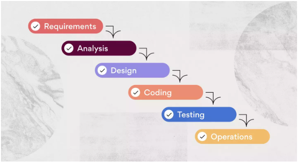
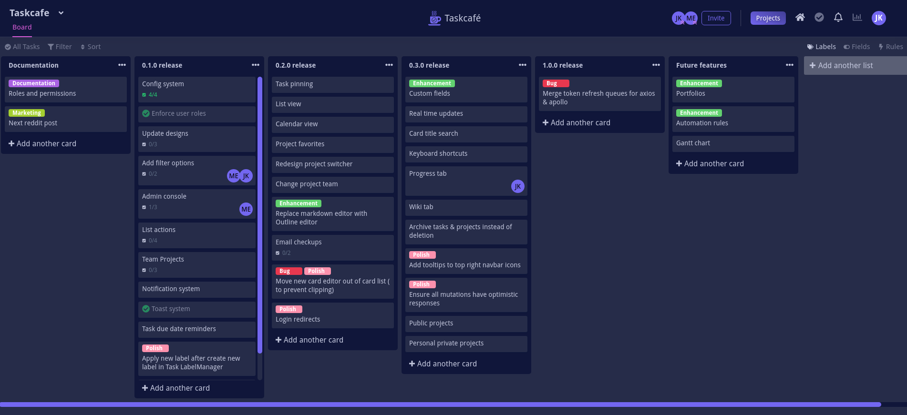

# Teorihandboken - Projektmetodik (PJ)
Studerande: Shaker Nasser Albu-salman 

## PJ 1.1 Agila metoder (Scrum, Kanban, Extreme Programming)

Agila metoder beskriver ett arbete som utförs i olika etapper eller sprintar. Projektformen framställs av dem stegen som utförs. Från beställning till färdigställd etapp. Under den processen följs stegen för planeringen av arbetet och genomförande av själva aktivitet. Att arbeta agilt gör att man kan skapa förutsättningar för sitt team och minska risker. Detta stärker teamet och skapar mindre hierarkiskt team. Metoden välkomnar förändringar under projektets gång. De vanligaste agila ramverk inkluderar Scrum, Kanban och Extreme Programming (XP). Agila arbetsmetod är först och främst utvecklat till arbete inom mjukvaruutveckling men det har även smittats till andra områden som kräver arbete i form av team/grupp arbete och konturering resultat.

Scrum är en av dem agila metoder som används för en systemutveckling. Begreppet härstammar från tekniken Scrum i sporten rugby där spelarna i teamet använder sig av axel mot axelformation för att föra bollen vidare till mål. Detta gjorde att dem japanska managementforskarna använda sig av detta begrepp till liknelse om hur systemutveckling i grupp bör ske. 
Rollerna delas upp i Scrum metoden och dem viktiga tre uttalade rollerna är; Produktägare, Scrum master och Teamet. Detta förenklar arbetet i grupp och ökar gruppens samhörighet. 
Produktägaren är den som förleder arbetet och agerar som projektledare hos beställaren. För att detta arbete ska framåt så leds det av ett Scrum Master som ser till att arbetet håller sig till deadlines och den standarden. Teamet i Scrum är så pass samhörig att arbetet fördelas själv organiserat och uppgiften löstes av gruppen. 
I Scrum så använder man sig av fem aktiviteter som kallas för sprintar. Dessa sprintar står för cykel av utveckling och ingår i en och samma iteration.

Sprint:
Iteration, utveckling över tid där utvecklingsgruppen visar resultat, sker oftast mellan 2-3 veckors tid. Dessa sprintar avlöser varandra.

Sprintplanering:
Innan nästa Sprint påbörjas så görs Springplanering. Detta görs tillsammans med produktägaren och sker i form av förberedelse och visualisera Sprintens mål. 

Daily Scrum:
Går även under namnet "daily stand-up" och består av ett obligatoriska dagligt möte med kort intervall på 15 minuter och man byter tankarna med varandra och presenterar vad man gjort. Mötets viktiga agenda är att man ska hjälpa varandra för att minska hinder i projektet. 

Sprint Review:
Detta möte är där utvecklingsteamet, Scrum master och produktägaren får vara med och få en review av utvecklingen i den sprinten. Mötet är till för att redovisa vad man hunnit med, och inte hunnit med samt hur nästa sprintar kommer att påverkas. 

Sprint retrospective:
Hantering av problem som uppstår i en sprint och här det upptäcks. Detta möte ger möjlighet till beröm för insatser och erfarenheter. 

Strukturen i arbetet har kravspecifikation på backlog där prioriterad och levande lista med önskemål skall följas. 

Kanban är en projektledningsmetod som härstammar från den japanska produktionen inom olika branscher där arbetet behöver kontinuerlig visualisering och uppföljning arbetsflödet. Detta för att förbättra förståelsen för deltagarna i arbetet om att förstå mer om vad som behöver göras. Arbeta utifrån Kanban-tavla innebär att arbeta utifrån att visualisera arbetsflödet, styra processen och maximera resultaten. Man arbetar med olika kort som representerar arbetsuppgifter. Man jobbar från vänstersida av tavlan till höger och går i logisk ordning. Detta för att kunna effektivera processen och eliminera slöseri av resurser men kunna leverera resultat snabbare. Om arbetet följer mönster "att göra", "pågående" och "klart" så hanteras den på en Kanban-tavla nivå. Fokuset i kanban nivå är kvalitetssäkra slutprodukter och förhindring av stopp och förseningar. Det tiden det tar för en uppgift att gå från "att göra" till "klart" kännetecknas av termen LeadTime (ledtid) som räknar tiden för avklarat uppgift. 

Extreme Programming är en agil mjukvaruutvecklingsmetodik som har i störst syfte att kunna omställa sig till dem ändrade kundkraven och arbeta utifrån förbättring av mjukvarukvaliteten. Metoden grundades av Kent Beck i mitten av 1990 talet och har sedan dess varit i utveckling. Extreme Programming som är även förkortad till XP betonar teamwork, kommunikation, enkelhet, kontinuerlig feedback och arbete med mod och respekt.
Extreme programming kännetecknas av följande praxis och principer:

Snabba interationer: vid varje interation så presenteras en fungerande mjukvaru inkrument som är redo för testning och leverans. Varje iteration sker i intervall av mellan 1 och 3 veckor.

Par programmering: hjälper till att upptäcka fel och möjlighet till förbättringar. Arbeta två och två när ena skriver koden så ser den andra till att hjälpa till med fel och förbättringar. 

Kontinuerlig integration: koden integreras kontinuerlig till versionskontrollsystem (tex Git/github) för att skapa mindre för konflikter samt tid till att upptäcka fel. 

On-sitekund: en representant för kunden bör finnas med för att ge kontinuerlig feedback och beslutfattande auktoritet. 

Liten utvecklingsgrupp: XP förespråkar om liten och själv styrande utvecklingsteam som är självgående och kan leverera en fungerande programvara. 

Simpel design: en enkel design med den mesta direkta lösningen för att undvika överkomplixet och skapa mer utrymme för utveckling. 

Extreme progamming har visat sig vara väldigt effektivt agilt metod och har smittat av sig till andra ramverk och metoder.

Källhänvisning (agila metoder): 
1. Julia Martins- 10 Oktober 2022- https://asana.com/sv/resources/what-is-kanban
2. Alicia Raeburn- 28 november 2022 -https://asana.com/sv/resources/extreme-programming-xp
3. Julia Martins- 9 Januari 2023 -https://asana.com/sv/resources/what-is-scrum 
4. Caroline Hasel- 9 Sep 2022 https://projektledning.se/vattenfallsmodellen/

## PJ 1.2 Icke-agila metoder

Icke agila metoder refereras ofta till dem traditionella utvecklingsmetoder. Metoder och tillvägagångsätt skiljs från dem principerna och ramverk som kännetecknar dem agila metoderna. 

Vattenfallsmodellen är en icke agil metod som används. Den har sitt fäste i tillverkningsindustrin där man arbetar utifrån att varje fas ska vara slutförd innan man börjar med nästa. Inom programvaruutveckling så har man börjat använda sig utav denna metod. I den traditionella vattenfallsmodellen arbetar man utifrån att varje fas ska vara slutförd innan man börjar med det nästa. Därav namnet vattenfallsmetoden då den efter liknar flödet som ett vattenfall. Detta lämpar sig till projekt som är väldefinierade och förändras sällan under projektets gång. 
Vattenfallsmodellen inkluderar olika faser:

Kravspecifikation (kravfasen):
För att uppnå ett framgångsrikt projektresultat så börjar man en inledande planeringsprocess i form av information insamling och en detaljerad projektplan som omfattar om specifika teammedlemmars arbetsuppgifter. I slutet av detta krav fas bör man ha en tydlig bild av projektet från start till slut. 
Detta inkluderar även bild av varje steg i processen, vilka teammedlemmar och kompetens som deltar och avslutningsvis en tidslinje som visar hur lång tid varje fas tar.

System Design (Systembolagsfasen):
Här specificeras vilken hårdvara teamet kommer att arbeta utifrån och om vilka andra teknologier som ska användas. I den detaljerade specifikation tar man även fram programmeringsspråk och användargränssnitt som skall användas. Här tar man även fram en detaljerad plan om arkitekturen och designen.

Implementation (Implementeringsfasen): 
Efter kravfasen och systembolagsfasen påbörjas implementeringsfasen där utvecklingsteamet påbörjar den fullständiga processen för att bygga programvaran. 

Testfasen (testningsfas):
Här börjar man genomföra tester för att kunna verifiera att systemen fungerar korrekt och uppfyller dem kraven man satte upp. 

Driftsättning:
När koden har testats och verifierats som fungerande, läggs den på den riktiga miljön där den ska användas. Slutanvändaren använder produkten. 

Maintenance (underhållsfas):
Hantering av eventuella framtida kravförändringar och ge möjlighet att lösa buggar. En tydlig övervakning av systemet.  

Vattenfallsmetoden har fördelar till att vara tydligt strukturellt och processen är enklare att följa. Dokumentationen gör att det finns detaljerade dokument som beskriver systemet. 
Dem nackdelarna som finns i vattenfallsmetoden är bristande flexibilitet och att risker upptäckas sent i projektets gång. Det blir svårare att hantera ändrade krav eftersom varje fas måste slutföras innan nästa påbörjas.

Inom vattenfallsmetoden så arbetar man väldigt mycket med dokumentation. Detta förenklar för projektgruppen och kunna planera för möjliga hot samt kunna backa och se tillbaka vid hinder/risker. Dokumentation är även bra till framtida projekt.
Nackdelen blir att väldigt mycket av tiden går åt att analysera och dokumentera. 

För att förtydliga och fördjupa sig i icke-agila metoder så kan man även se andra fallstudier där konkreta vattenfallsmetoder har använts. Inom rymdskyttelstillverkning, storskaliga mjukvaruprojekt och komplexa byggnadsprojekt så använder man sig av metoden. I dessa slutprodukter så är det svårt att kunna planera flera lanseringar. Slut produkten skall vara i sånt bruk att inga komplexa eller risktagande problem uppstår. 
Inom rymdskyttelstillverkning har till exempel Nasa (Nasa Space Shuttle) kunnat använda sig av vattenfallsmodellen. Detta resulterade till ett framgångsrikt uppdrag i rymden på grund av den välplanerade detaljplanen och utförande.

Källhänvisning (Icke-agila metoder):

1. https://theagileproject.wordpress.com/vattenfallsmodellen/
2. https://asana.com/sv/resources/waterfall-project-management-methodology
3. https://llis.nasa.gov/lesson/24502

## PJ 1.3 Entreprenörskap inom webbutveckling

När man jobbar som teammedlem under ett projekt så behöver man oftast inte tänka så mycket på kostnader eller intäktsmodeller. Dessa delar brukar oftast ens arbetsgivare sköta. Entreprenörskap är mest bjudande till den som har drivkraften till att starta eget och bli entreprenör.
För att kunna bli en framgångsrik entreprenör inom webbutveckling så bör man ha vissa saker med sig. Det mest självklara är att kunna samla på sig kompetens inom webbutveckling för att kunna få klarare bild av dem andra faser. Kompetens kan bestå av att man är bra på saker och inte fullt ut professionell. Det som gör en lyckad entreprenör är drivkraften och förmågan att samla in information och kunna bearbeta det.
En samlad detaljplan i form av dessa punkter är vad som kan göra en lyckad entreprenör:

Kompetens inom webbutveckling:
Skapa färdigheter och samla in kompetens inom dem programmeringsspråket och ramverken som används inom Webbutveckling. En sån kompetens kan innebära också att kunna arbeta med agila metoder och kunna arbeta med andra.

En detaljerad affärsplan:
Genom en detaljerad affärsplan så skapar man en förutsättning för sig själv genom att hålla sig fokuserad och en vägledning till att ta viktiga beslut. En affärsplan kan man jobba på genom verksamma år. Det gäller dock att han en tydlig grund och inkludera målgruppen och skapa en konkurrensanalys. Marknadsföring är en väldigt stor del för att locka till kunder men även samarbetspartner i framtida projekt. 

Mellan dessa faser så är det bra att vara påläst om vilka bestämmelser och skyldigheter man har som en entreprenör. Detta kan man oftast lära sig genom företag som erbjuder juridiska hjälp eller läsa själv om detta som tex på Skatteverkets hemsida (om man vill starta i Sverige). Här är det även viktigt att börja tänka vilken företagsform man vill ha. Vill man ha ett aktiebolag eller handelsbolag? Det finns flera företagsformer som passar just ens egna affärsplan. Inom detta så ska man få en samlad detaljplan om lönekostnader och försäkringskostnader. I lönekostnader så kan det tex handla om avgifter (arbetsgivaravgift) och prelimnäraskatter. En del av kostnader går till så kallad Overheadkostnader där semesterlönen, sjukdomslön och tjänstepensionen inräknas. 
Man bör även ha koll på dem kostnaderna som finns av inköp för materialkostnader och teknologiska. 
En sådan kostnad kan även innebära licenskostnad. 
I detta stadie ska man även kunna förstå sig på intäktsmodeller. En enkel intäktsmodell kan innebära att räkna ut pengarna man kan får från bindningstider av projekt, månadsavgift, licenskostnad och projektpris. 

Känna till dem olika faser i ett:
Genom att känna till dem olika faserna i ett projekt så blir detaljplanen och prissättningen enklare.
Idé och efterforskning är en av dem startpunkterna i ett projekt. Dem punkterna tar slut när designfasen börjar. Utvecklingsfasen innebär att man jobbar på lösningar, Apier och databaser kopplas samman och grafiska lösningar byggs upp. 

Prissättning: 
Genom att läsa in sig och göra en tydlig research så kan man oftast få fram en prissättning. Ibland är det bra att börja med att tänka ut om vad kunden är redo att betala och hur stort behovet kunden har av denna projekt/produkt. En annan prissättningsmodell kan vara att man lurkar i vad konkurrenternas prissättning där och arbeta utifrån det. 
Hemsidor som erbjuder hjälp pristsättning: https://asana.com/sv/pricing 

Att sticka ut:
Genom att specialisera sig inom ett område inom webbutveckling, tex inom E-handelsplattformar då webbutveckling är en bred bransch under ständig utveckling. 

Gott rykte och marknadsföring:
Huvudnyckel till att man blir vidare rekommenderad. Ett gott rykte är grunden till att man får fler projekt och nyckeln ligger i att vara lyhörd till kunderna och möta upp till deras förväntningar. Kunderna kan oftast inte så mycket om programmering, det gäller att prata ett klarare och ge tydliga språk, till exempel på förbättringar och föreslå Idér. 
Marknadsföring är väldigt viktigt i webbutveckling branschen. Dem digitala annonser är en kostnadseffektiv gentemot den fysiska. Det gäller att nå ut till rätt målgrupp men också genom att visa pålitliga reslutat. En portfolio med vilka kunskaper och projekt man skapat kommer att stärka pålitligheten. 

En strukturell hantering av verksamheten: 
Genom att ha en struktur och ordning så kan man hålla fokuset på andra delar verksamheten kan gynnas av.

Investering i tid och tålamod:
Oftast kan man få en förenklad blid av hur entreprenörskap är. Många framgångsrika entreprenörer har investerat i sin tid genom att till exempel ständigt vara i inlärningsfasen och kunna investera sin tid till att utvecklas. Tålamod är något som betonas väldigt mycket då flera år kan gå utan att man kan se tydlig framgång i företaget till att ena året kan blomstra. 

Ett bra sätt att kunna driva företaget till framgång är att visualisera affärsmodellen. Detta kan man tex göra i en Business Modell Canvas.

Källhänvisning (Entreprenörskap inom webbutveckling):

1. https://www.fortnox.se/fortnox-foretagsguide/starta-eget-foretag/it-webbkonsult
2. https://skatteverket.se/foretag/drivaforetag/startaochregistrera/fordigsomvillstartaforetag.4.6e8a1495181dad540842251.html
3. https://asana.com/sv/pricing

Föreläsningskälla -Lektion av Hanna Liman 2023-10-11

## PJ 1.4 Issue distribution and handling in a group

Issues distribution är svenskas motsvarighet till arbetsfördelning. Oftast pratar man om issue är ett "kort" som består av olika arbetsuppgifter och som innehåller information om vem som är ansvarig för varje arbetsuppgift. I dem korten så innehåller det information om milstolpar och prioritet samt bifogade filer för att del av. Detta gör att projekten hanteras på ett effektivt sätt och att man kan säkerställa att inga uppgifter förbises. 
Arbetsfördelning handlar om att organisera och fördela arbetsuppgifter på ett visuellt och strukturellt sätt. Det finns flera guider till hur man kan använda dessa kort i så kallade brädor eller tavlor. Dessa gör det enkelt att kunna skapa en strukturell tavla med flera fält. Dem flesta guider och verktyg använder liknande arbetsfördelning även om plattformarna ser annorlunda ut. 

Github har en issue distribution som används av väldigt många inom it branschen. Dessa steg förenklar arbetet av issue distribution i GitHub:

Issues (skapa och hantera):
Genom att issues (kort) för varje arbetsuppgift, problem eller förbättringsförslag. Tydliga beskrivningar ökar framgångsrikt resultat. Etiketterna ska inte likna varandra om arbetsuppgifterna är olika. 

Milstolpar:
Milstolpar är en annan viktig aspekt av issue distribution i GitHub. De används för att gruppera issues som hör samman med en specifik version, en projektfas eller en annan kategori. Genom att skapa och använda milstolpar kan teamet skapa en strukturerad och övergripande översikt över projektets framsteg.

Utse ansvariga: 
Genom att tilldela issues till specifika teammedlemmar genom att utse dem som ansvariga. Det skapar ansvarstagande och ökar sannolikheten för att uppgiften blir slutförd i tid. 

Använd etiketter:
Använd etiketter för att kategorisera och prioritera issues. Du kan ha olika etiketter för olika typer av uppgifter, t.ex. "bug", "feature" osv.

Använda projekt (tavla)
Kanban-liknande tavla som har fält och kolumner där man kan anpassa projekt för att passa ens egna arbetsprocess.

Fördela efter kompetens:
Teammedlemmarnas kunskapsområden är viktig i denna steg. Här ska man tänka på att fördela på ett rätt sätt för att kunna utnyttja varje teammedlems starka sidor. 

Använda mention:
Använd @username-syntaxen i kommentarer för att nämna specifika användare och notifiera dem om en viss issue eller kommentar.

Följ upp och kommunicera:
Regelbundna uppdateringar om statusen för issues. Detta kan göras som kommentarer i issues eller genom regelbundna möten med teamet.

Sammanfattningsvis, issue distribution i GitHub är en process för att organisera och fördela arbetsuppgifter i ett projekt. Genom att använda issues, milstolpar, ansvariga, projekt och regelbunden uppföljning kan teamet säkerställa att inga uppgifter förbises och att arbetsbelastningen fördelas jämnt. Denna strukturerade metod främjar effektivt samarbete och bidrar till projektets framgång.
Genom att fördela arbetsuppgifter baserat på teammedlemmarnas kompetens och tillgänglighet kan resurserna användas på ett optimalt sätt, vilket leder till en mer effektiv användning av arbetskraften.

Gruppens dynamik är avgörande för ett lyckat bolag och framgångsrika projekt. Arbetet innebär även att man jobbar mot gemensamt mål och slutföra målet på ett framgångsrikt sätt. 
Förtroende och ömsesidig respekt är nödvändig för att arbeta effektivt. I varje grupp så kan konflikter uppstå. Det gäller att ta tag i konflikterna på ett konstruktivt och respektfullt sätt. Uppmuntra till öppen diskussion och upplysa om lösningar som gynnar gruppens dynamik. 
Hålla varje medlem ansvarig för sina uppgifter och ansvar. Detta främjar en känsla av ägarskap och säkerställer att alla bidrar till gruppens framgång. 
Ett viktigt steg är att fira framgångar och höja moralen. Detta förstärker känslan av prestation.

Källhänvisning (Issue distribution and handling in a group)

1. https://github.com/issues
2. https://asana.com/sv/uses/kanban-boards
3. https://www.ef.se/blog/language/8-tips-for-att-lyckas-med-grupparbeten/

Föreläsningskälla - Hanna Liman - lektion presentation om agila metoder och Issue distribution - Tisdag 3/10-2023
