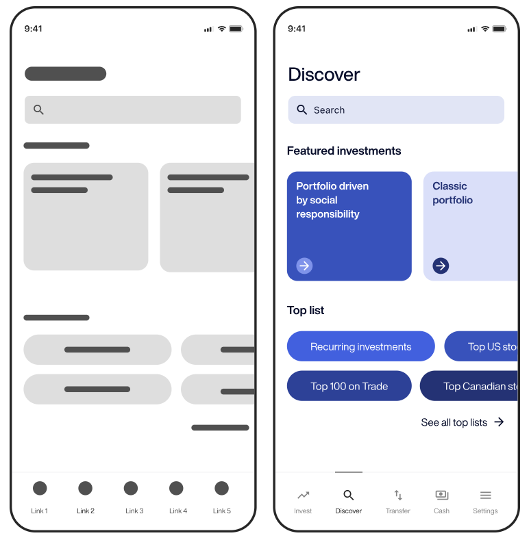

# Teorihandboken - UX och design (UD)
Studerande: Shaker Nasser

## UD 1.1 Grafik och design för webbsidor

Att skapa en välutformad webbsida innebär inte bara att den ska vara snygg med att titta på, utan också att den ska fungera felfritt för användaren. Inom webbdesign är användbarhet en grundläggande princip, vilket innebär att användaren enkelt ska kunna navigera och interagera med webbsidan. För att uppnå detta är det viktigt att skapa en logisk layout och använda tydliga navigationsmenyer.

Grafik spelar en nyckelroll inom webbdesign och kan markant förbättra användarupplevelsen. Genom att använda visuella element som bilder och ikoner kan webbsidan bli mer engagerande och minnesvärd. Det är dock viktigt att optimera grafiken för webben för att säkerställa snabba laddningstider och en effektiv användarupplevelse.

För att skapa en enhetlig design är det också viktigt att använda en harmonisk färgval och välja typsnitt som är lättlästa på skärmen. Att överväga kontrast och hierarki i designen hjälper till att framhäva viktig information och gör sidan lättare att förstå.

Responsiv design är en annan viktig aspekt att tänka på inom webbdesign. Eftersom användare kan komma åt webbsidor från olika enheter och skärmstorlekar är det avgörande att designa webbsidor som dynamiskt anpassar sig efter olika skärmstorlekar.

För att hålla sig uppdaterad inom området är det viktigt att följa trender inom grafik och design för webb. Det kan inkludera att hålla koll på nya designverktyg och tekniker samt att studera framstående exempel på webbdesign för att dra inspiration och lära sig nya metoder.

1. https://webbriktlinjer.se/riktlinjer/124-inte-bara-farg/
2. https://webbdesignfabriken.se/bra-tips-angaende-din-hemsidedesign/

## UD 1.2 UX och användbarhet

Användarbarhet syftar på hur användarvänlig och lättanvänd en produkt eller en systemgränssnitt är för dess avsedda användare. Det handlar om att säkerställa att en produkt eller en webbplats är enkel att förstå, navigera och använda utan onödiga hinder eller förvirrande element. För att uppnå det så måste man följa upp vissa egenskaper. 

Användarupplevelse (UX) och användbarhet är två centrala begrepp inom webbutveckling och design som tillsammans utgör grunden för att skapa effektiva och tillfredsställande digitala produkter. Dessa begrepp fokuserar på att förstå och tillmötesgå användarens behov för att skapa meningsfulla interaktioner och positiva intryck.

UX eller användarupplevelse innebär den övergripande känslan och intrycket som en användare har när de interagerar med en digital produkt eller tjänst. Det sträcker sig över hela användarresan, från den första kontakten med produkten till interaktionen och eventuell återkommande användning. Ett framgångsrikt UX-designarbete innebär att skapa en positiv, meningsfull och problemfri upplevelse för användarna.

För att framgångsrikt uppnå en positiv UX är användbarhet en av de mest grundläggande aspekterna. Användbarhet handlar om hur användarna kan interagera med en digital produkt på ett enkelt och effektivt sätt för att uppnå sina mål. Det inkluderar tydlig navigering, enkel design och intuitiva interaktionsmönster. Användbarhet är avgörande för att skapa en positiv användarupplevelse eftersom det direkt påverkar användarnas förmåga att utföra uppgifter och hitta information snabbt och enkelt.

För att förbättra användbarheten är det viktigt att genomföra användartester och studier av användbarhet. Genom att observera och analysera hur verkliga användare interagerar med produkten kan designer få värdefull insikt i eventuella problemområden och möjligheter till förbättring. Användartester ger också möjlighet att validera designbeslut och säkerställa att produkten effektivt möter användarnas behov och förväntningar.

Det är också viktigt att lyssna på användarfeedback och kontinuerligt förbättra produkten. Användarupplevelsen är dynamisk och förändras över tiden, vilket gör det nödvändigt att vara lyhörd för användarnas behov och önskemål. Genom att implementera en iterativ designprocess kan produkten ständigt förfinas och anpassas för att möta användarnas förväntningar.

I sammanfattning är UX och användbarhet nära sammankopplade när det kommer till att skapa framgångsrika digitala produkter. Genom att fokusera på användarnas behov, genomföra användartester och sträva efter en intuitiv och responsiv design kan designers skapa en användarupplevelse som inte bara är funktionell utan också engagerande och tillfredsställande.

1. https://www.ibm.com/blogs/think/se-sv/2021/01/11/vad-ar-ux-design-egentligen/
2. https://raidboxes.io/sv/blog/webdesign-development/ux-design-usability/
3. https://www.one.com/sv/digital-marknadsforing/forbattra-webbsidans-anvandarvanlighet

## UD 1.3 Riktlinjer för användbarhet

Webben är en viktig del av våra liv, som används för olika ändamål, från att söka information till online shopping och banktjänster. Men alla har inte samma nivå av tillgång till webbinnehåll. Det finns användare med funktionshinder eller tekniska begränsningar som gör det svårt för dem att interagera med webbplatser. För att komma till rätta med detta har initiativ som ARIA, WAI-ARIA, A11y och WCAG utvecklats.

ARIA tillåter utvecklare att beskriva interaktiva element och dynamiska innehållsuppdateringar, vilket gör dem tillgängliga för personer med funktionshinder som använder hjälpmedel. WAI-ARIA, en del av World Wide Web Consortium, tillhandahåller riktlinjer och specifikationer för att förbättra webbtillgängligheten. A11y är ett åtagande att skapa tillgängliga produkter och tjänster, som integrerar tillgänglighetsprinciper i designprocessen. WCAG erbjuder riktlinjer för att bedöma tillgängligheten av webbsidor, som täcker perceptuell, kognitiv och motorisk tillgänglighet.

Skärmläsare är avgörande för att personer med synnedsättning ska kunna navigera på webbsidor. Dessa program tolkar visuellt innehåll och konverterar det till talat eller taktilt format. Utvecklare måste designa webbsidor som är kompatibla med skärmläsare för att säkerställa tillgänglighet.

Sammanfattningsvis är webben en kraftfull plattform som berikar våra liv, men alla användare har inte lika tillgång. Initiativ som ARIA, WAI-ARIA, A11y, WCAG och skärmläsare spelar en viktig roll för att främja webbtillgänglighet och skapa en inkluderande digital värld. Genom att införliva dessa insatser i webbdesign och utveckling kan vi säkerställa att alla har lika möjligheter att dra nytta av webbens möjligheter.

1. https://webbriktlinjer.se/riktlinjer/81-utveckla-webbplatsen-enligt-en-standard-snarare-an-for-en-webblasare/
2. https://www.metamatrix.se/globalassets/vara-tjanster/tillganglighetsguide_metamatrix_v16.pdf

## UD 1.4 Prototyping

Prototyptillverkning är en central del av webbdesignprocessen och fungerar som ett kraftfullt verktyg för att visualisera och testa designidéer innan de implementeras fullt ut i koder. Det finns två huvudsakliga typer av prototyper inom webbdesign: prototyper med låg trohet och prototyper med hög trohet.

Prototyper som Low-fidelity används i de tidiga stadierna av designprocessen för att snabbt skissa och kommunicera grundläggande koncept. Dessa prototyper är vanligtvis grova och enkla, med minimal detalj och estetisk finish. De kan skapas med hjälp av papper och penna, digitala skisser eller prototypverktyg som enkelt tillåter designern att snabbt dra ihop grunderna för användargränssnittet. Prototyper med låg trohet är särskilt användbara för att utforska olika designalternativ, förstå användarflöden och få feedback från intressenter utan att investera för mycket tid och resurser.

High-fidelity-prototypen å andra sidan representerar en mer detaljerad och nära slutgiltig version av det planerade användargränssnittet. Dessa prototyper innehåller vanligtvis realistiska utseenden och interaktioner, inklusive färgscheman, typsnitt och andra grafiska element. High-fidelity-prototyper kan skapas med hjälp av avancerade prototypverktyg eller till och med som interaktiva webbsidor. Dessa prototyper används vanligtvis i de senare stadierna av designprocessen för att ge en mer exakt representation av hur den slutliga webbsidan eller applikationen kommer att se ut och fungera.

Prototyperna Low-fidelity och High-fidelity prototypen kompletterar varandra genom att erbjuda olika detaljnivåer och funktionalitet vid olika stadier av designprocessen. Genom att använda båda typerna av prototyper får designern möjlighet att utforska, testa och förbättra designen på ett effektivt sätt. Vilket i slutändan leder till en mer användarvänlig och genomtänkt digital produkt.

1. https://www.figma.com/resource-library/what-is-prototyping/
2. https://www.usability.gov/how-to-and-tools/methods/prototyping.html
3. https://www.simplilearn.com/prototyping-in-design-thinking-article

## UD 1.5 Personas och målgruppsanalys

Inom webbutveckling är personas och målgruppsanalys viktiga verktyg för att skapa en design som är användarcentrerad och säkerställa att din webbplats eller applikation är relevant och användbar för dina användare. Här är en översikt över begreppen och deras betydelse:

En persona är en fiktiv representation av en idealiserad användare baserad på verkliga data och insikter om din målgrupp. Genom att skapa personas får utvecklare och designers en tydligare förståelse för användarnas behov, beteenden, mål och förväntningar.

För att skapa en persona samlar man in data genom användarundersökningar, intervjuer och analyser av befintliga användardata. Man identifierar gemensamma drag och mönster och skapar sedan en detaljerad profil som inkluderar information som ålder, kön, yrke, mål, utmaningar och tekniska preferenser. Personas används som referenspunkter under hela utvecklingsprocessen. De hjälper till att fatta beslut om design, funktionalitet och användarupplevelse genom att sätta användaren i centrum för beslutsfattandet.

Att analysera målgrupper är processen att undersöka och förstå de olika segmenten av din publik. Det innebär att identifiera olika grupper av användare baserat på demografi, beteenden, preferenser och andra relevanta faktorer.

Analysen involverar att samla in och analysera data om dina användare. Det kan inkludera demografisk information, beteendemönster, preferenser och teknisk kompetens. Resultaten används för att skapa segment av användare med liknande egenskaper och behov. Målgruppsanalys ger insikter som vägleder utvecklingen av en webbplats. Genom att förstå olika segment av användare kan utvecklare anpassa design, innehåll och funktioner för att möta specifika behov och förväntningar hos varje grupp.

Både personas och målgruppsanalys är kritiska verktyg för att säkerställa att din webbplats eller applikation är användarcentrerad och effektiv. Genom att skapa realistiska och väldefinierade personas samt genomföra en noggrann målgruppsanalys kan du skapa en mer meningsfull och engagerande användarupplevelse. Detta leder i sin tur till ökad användarnöjdhet och framgång för din webbplats.

1. https://foretagsforumet.se/marknadssegment/
2. https://www.toxic.se/blogg/vad-ar-skillnaden-pa-malgrupp-och-personas/
3. https://www.leit.se/kunskapsbank/personas/

## UD 1.6 Empiriska metoder

Empirisk forskning är en typ av forskning eller studie där slutsatserna baseras på konkreta och verifierbara empiriska bevis. Där man undersöker och obeserverar för att skaffa kunskap och för att samla in krav. Syftet med empirisk forskning är att använda statistiska testmetoder för att testa hypoteser och minska klyftan mellan teori och praktik. 

Empirisk forskning bidrar till att förbättra, analysera och utvärdera procedurer och processer för mjukvaruutveckling. Den ger också riktlinjer för beslutsfattande. Empirisk forskning är användbar för forskare, akademiker och mjukvaruindustrin i olika scenarier.

Empirisk forskning kan användas för att besvara frågor som rör industriella metoder och kan förbättra strategier och metoder för mjukvaruutveckling. De prediktiva modeller som skapas inom ramen för empirisk forskning kan implementeras i liknande industriella tillämpningar i framtiden. Empirisk forskning möjliggör för mjukvaruutvecklare att tillämpa resultaten av experimentet och försäkra sig om att en uppsättning väl fungerande procedurer och processer följs vid någon punkt i mjukvaruutvecklingen. Empirisk forskning ger också vägledning för att bestämma de bästa mjukvaruprocesserna och produkterna som genereras.

Deltagarna är de personer som är involverade i forskningen som försökspersoner. De intervjuas noggrant för att erhålla forskningsresultaten. Etiska frågor inom empirisk forskning måste beaktas vid hanteringen av deltagarna för att säkerställa att de inte skadas på något sätt.

Resultatet av forskningen genererar en produkt. Det slutliga resultatet av empirisk forskning ger svar på forskningsfrågorna. En ny teknik eller metod kan betraktas som en produkt av den empiriska studien eller forskningen. Exempel på detta kan vara konferensartiklar, tidskriftspapper, avhandlingar och tekniska rapporter.

1. https://www.geeksforgeeks.org/empirical-research-in-software-engineering/
2. https://yufreepress.org/sv/empirisk-forskning-definition-metoder-typer-och-exempel/

## UD 1.7 Grundläggande kognitionspsykologi

Kognitionspsykologi är en disciplin inom psykologin som undersöker hur människor bearbetar information, tänker, lär sig och minns. Inom webbutveckling är kunskap om kognitiva processer avgörande för att skapa användarvänliga och effektiva webbsidor. Här är några viktiga aspekter av kognitionspsykologi inom webbutveckling:

För att skapa en användarvänlig webbplats är det viktigt att förstå hur människor uppmärksammar och tolkar information. Genom att designa webbsidor med tydliga visuella hierarkier och användarvänliga gränssnitt kan man underlätta uppmärksamheten och navigeringen.

Människors minneskapacitet påverkar hur de interagerar med webbsidor. För att underlätta minnesprocessen är det viktigt att använda korta och lättförståeliga texter, tydliga rubriker och skapa en logisk informationsstruktur.

Användarupplevelsen på en webbplats påverkas av hur väl användare kan lösa problem och fatta beslut. Skapa enkla och intuitiva användargränssnitt för att underlätta interaktion och beslutsfattande.
Responsiv design:

Eftersom användare kan komma åt webbsidor från olika enheter och skärmstorlekar är det viktigt att designa responsiva webbsidor. Anpassa layout och innehåll för olika skärmar för att ge en enhetlig upplevelse.

Använd tydligt och lättläst språk på webbsidor. Undvik jargong och tekniska termer som kan förvirra användare. Begreppsbildning är viktigt för att användare ska förstå och navigera på webbplatsen.
Kognitionspsykologi inom webbutveckling avgörande för att skapa användarvänliga, effektiva och minnesvärda webbsidor. Genom att förstå hur människor tänker och interagerar kan vi skapa en bättre digital upplevelse för användarna.

1. https://people.cs.umu.se/gabriel/mdi/2.html (Umeå Universitet)
2. http://www.diva-portal.se/smash/get/diva2:728228/FULLTEXT01.pdf (Linköpings universitet)